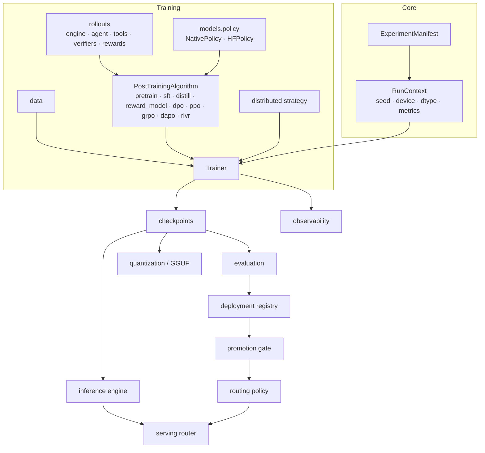

# Forgeline

Post-training, distributed training, evaluation, inference and model lifecycle for language models — in one PyTorch framework that runs end to end on a laptop CPU and scales out on GPUs.

---

## Overview

Forgeline covers the full path from raw text to a served, gated and reversible model:

```
data ─► pretraining ─► SFT / LoRA / QLoRA ─► preference data + reward models ─► DPO
     ─► PPO / GRPO / DAPO / RLVR (tools, verifiers, process rewards) ─► AI feedback, STaR, hill climbing
     ─► distributed execution ─► checkpoints + recovery ─► evaluation + regression gates
     ─► quantization / GGUF export ─► KV-cached continuous-batching inference ─► OpenAI-compatible serving
     ─► candidate registry ─► champion / challenger rollout ─► rollback, with structured observability throughout
```

Every stage is driven by one experiment manifest, runs through one trainer lifecycle, writes one checkpoint format and emits one metric/event stream.

## Why This Framework Exists

Post-training work usually lives in disconnected scripts: each algorithm with its own loop, checkpoint layout and logging, evaluation that does not feed deployment decisions, and serving that knows nothing about which model should win. Forgeline makes those seams explicit contracts — `PolicyModel`, `RewardProvider`, `Verifier`, `PostTrainingAlgorithm`, `DistributedStrategy`, `EvaluationResult`, `ModelCandidate` — so algorithms stay small, results are comparable, and a model moves from training to traffic through auditable gates.

It is designed to be verifiable without GPUs: a 0.1M-parameter preset exercises every algorithm, the inference engine, the server and the lifecycle on CPU, while hardware-dependent paths are covered by tests that skip cleanly when CUDA is absent.

## Capabilities

| Area | Capabilities |
|---|---|
| Models | decoder-only transformer; multi-head and grouped-query attention; multi-head latent attention with compressed KV cache; native sparse attention; RoPE with linear/YaRN scaling; SwiGLU/GELU; sliding-window and alternating layers; logit soft-capping; mixture of experts (shared experts, aux-loss-free and group-limited routing); multi-token prediction; gradient checkpointing |
| Generation | temperature, top-k, top-p, min-p, repetition penalty, stop tokens, KV cache, speculative decoding (draft model and self-drafting MTP heads) |
| Efficiency | fp16/bf16 autocast, gradient scaler, LoRA, QLoRA with NF4 base weights, 8-bit loading (HuggingFace), gradient accumulation, FSDP, GGUF FP16/Q8_0/Q4_0 |
| Training | pretraining (memmap, sharded, text-glob and HuggingFace streaming), SFT with prompt masking, distillation (logit KL + feature matching) |
| Post-training | reward models, DPO (sum / length-normalised / reference-free), PPO, GRPO, agent GRPO with tools, process-reward GRPO, critic-augmented rewards, DAPO, RLVR, AI-feedback self-judge DPO, pairwise judging, constitutional critique→revise, STaR, hill climbing |
| Rewards & verifiers | math, exact match, tagged final answer, code execution, format; rule, composite, process, critic and learned-model rewards |
| Distributed | single, DDP (every algorithm, including RL), FSDP, DeepSpeed ZeRO, tensor parallel, pipeline parallel (1F1B), 3-D mesh |
| Orchestration (optional) | Ray worker pools for rollout generation, reward/verifier scoring, sandboxed tools and sharded evaluation; placement groups, weight sync from the learner, worker replacement and bounded retries |
| Reliability | atomic directory checkpoints with manifests, validation, latest discovery, bit-for-bit resume, typed actionable errors |
| Evaluation | held-out loss/perplexity, verifier pass rate, malformed-output rate, agent accuracy and tool use, reward statistics, preference win rate, latency/throughput/memory, MMLU/HellaSwag/ARC/GSM8K/TruthfulQA/HumanEval, regression rules |
| Inference & serving | continuous batching, paged block allocation, request lifecycle and cancellation, `/health`, `/v1/models`, `/v1/completions`, `/v1/chat/completions`, SSE streaming, `/metrics` |
| Lifecycle | candidate registry (experimental → shadow → challenger → champion → retired), fail-closed promotion gates, feature flags, deterministic champion/challenger/shadow routing, offline replay, rollback, kill switch |
| Observability | structured logs, local JSONL metrics and events, W&B and TensorBoard sinks, spans, gradient norms, serving metrics; optional local dashboard over runs, checkpoints, evaluations, the registry, benchmark evidence and model internals (attention, activations, weights) |

## Architecture



| Package | Role |
|---|---|
| `forgeline.core` | configuration, manifest, protocols, registry, runtime, run context, errors |
| `forgeline.data` | tokenizers, schemas, datasets, streaming, collators, preprocessing |
| `forgeline.models` | transformer, attention, MoE, generation, adapters, quantization, policies, reward model |
| `forgeline.training` | trainer lifecycle and every training/post-training stage |
| `forgeline.rollouts` | rollout engines, tools, verifiers, reward providers |
| `forgeline.distributed` | runtime, mesh, tensor/pipeline parallel, strategies |
| `forgeline.checkpoints` | save, load, validate, resume |
| `forgeline.evaluation` | suites, benchmarks, regression, performance, inspection |
| `forgeline.inference` | requests, paged allocator, scheduler, engine |
| `forgeline.serving` | schemas, backends, router, HTTP server |
| `forgeline.deployment` | candidates, registry, promotion, flags, routing, rollback |
| `forgeline.observability` | logging, metrics, events, tracing |
| `forgeline.orchestration` | optional Ray worker pools (rollout, reward, tool, evaluation) |
| `forgeline.dashboard` | optional read-only dashboard (data layer, HTTP server, single-page UI) |
| `forgeline.domains.synthesis` | synthesis-condition optimisation task family |
| `forgeline.cli` | the `forgeline` command |

Details: [docs/architecture.md](docs/architecture.md). Complete reference in one document: [docs/GUIDE.md](docs/GUIDE.md). Engineering and evidence dossier (every subsystem, benchmark provenance, validation boundaries): [FORGELINE_COMPLETE_ENGINEERING_DOSSIER.md](FORGELINE_COMPLETE_ENGINEERING_DOSSIER.md).

## End-to-End Model Lifecycle

```bash
forgeline data prepare --input data/samples/text/tiny_corpus.txt --output data/prepared/tiny --tokenizer char
forgeline train configs/training/pretrain_tiny_cpu.yaml
forgeline train configs/training/sft_tiny_cpu.yaml     --set checkpoint_path=runs/pretrain-tiny-cpu/checkpoints/final
forgeline train configs/post_training/dpo_tiny_cpu.yaml --set checkpoint_path=runs/sft-tiny-cpu/checkpoints/final
forgeline evaluate --checkpoint runs/dpo-tiny-cpu/checkpoints/final --suites gsm8k mmlu --offline --output runs/eval.json
forgeline registry register --name assistant --version v1 --algorithm dpo --checkpoint runs/dpo-tiny-cpu/checkpoints/final --metrics-file runs/eval.json
forgeline registry promote --id <id> --to champion --gate configs/deployment/promotion_gate.yaml
forgeline export --checkpoint runs/dpo-tiny-cpu/checkpoints/final --output runs/model-q8.gguf --quantize q8_0
forgeline serve --checkpoint runs/dpo-tiny-cpu/checkpoints/final --routing configs/deployment/routing_champion_challenger.json
forgeline registry rollback --name assistant --reason "regression in production"
```

`examples/01_end_to_end_lifecycle.py` runs the same lifecycle in one Python script.

## Data Pipeline

* Tokenizers: character-level (dependency-free), tiktoken, HuggingFace; metadata stored with token files and inside checkpoints.
* Schemas with validation for SFT pairs, preference pairs, verifiable tasks, process-reward records and scored texts; malformed records raise with `file:line` or are skipped with a report.
* Deterministic seeded splits; memmap random windows; sharded/streaming corpora split by rank and worker; constant-memory shard writer.
* `forgeline data prepare | prepare-hf | shard | gsm8k | validate`.

[docs/data.md](docs/data.md)

## Pretraining and SFT

* Token cross-entropy with MoE auxiliary and multi-token-prediction losses.
* AdamW with matrix-only weight decay, cosine / warmup-stable-decay / constant / linear schedules, gradient accumulation and clipping, fp16/bf16, `torch.compile`, gradient checkpointing.
* SFT masks prompt and padding tokens; evaluation tracks held-out loss and saves best checkpoints.
* Knowledge distillation: `α·T²·KL + (1−α)·CE`, optional hidden-state matching.

[docs/training.md](docs/training.md)

## LoRA / QLoRA

* `trainer.adapter: {method: lora|qlora, rank, alpha, dropout, target_modules}`.
* LoRA is identity at initialisation; adapters can be disabled (the reference policy), saved alone, reloaded and merged.
* QLoRA stores frozen base weights as NF4 (blocks of 64, 16 normal-float levels, 2 indices per byte).
* HuggingFace policies (`backend: {type: huggingface, model_name: …}`) use PEFT LoRA and can load base weights in 8-bit; `scripts/export_adapter.py` exports or publishes adapters.

[docs/models.md](docs/models.md) · [docs/quantization.md](docs/quantization.md)

## Preference Optimization

DPO: `−log σ(β(log π(y_w|x) − log π_ref(y_w|x)) − β(log π(y_l|x) − log π_ref(y_l|x)))` with `logprob_reduction: sum|mean`, optional reference-free mode and label smoothing. The reference policy is the same network with adapters disabled, or a frozen copy.

## Reward Modeling

A transformer backbone with a scalar head trained with the Bradley-Terry loss `−log σ(r_chosen − r_rejected)`; used for RL through `RewardModelProvider`, or blended with rule rewards. `EncoderRewardModel` scores text with a Transformer encoder trained either by regression on scalar targets or with the Bradley-Terry loss.

## PPO

Value-head PPO with clipped surrogate, value MSE and entropy terms. Options: sequence-mean or token-level ratios; KL monitored, penalised, or subtracted from rewards; sampled-token or full-distribution entropy; GAE utility.

## GRPO

Group-relative advantages `(r − mean)/(std + ε)` over `G` samples per prompt, no value model. Clipped objective with KL penalty, or unclipped REINFORCE. Agent mode runs multi-turn tool episodes and conditions each segment's log-probs on prior tool results.

## RLVR

Verifiers replace learned rewards: math answers, exact match, tagged final answers, unit-test execution in a subprocess, and output format. `RLVRConfig` combines a correctness verifier and a format verifier and trains with DAPO or GRPO; `evaluate_pass_rate` reports pass and malformed-output rates.

[docs/rlvr.md](docs/rlvr.md)

## Advanced Post-Training

| Method | Summary |
|---|---|
| DAPO | clip-higher, dynamic sampling of zero-variance groups, token-level normalisation, overlong reward shaping, entropy bonus |
| Process rewards | step splitting and arithmetic/code verification with `γ`-discounted step credit plus final-answer reward |
| Critic rewards | heuristic or LLM critic scores composed with verifiable rewards |
| AI feedback | self-judged candidates → reference-free DPO rounds; pairwise judge → preference data; constitutional critique→revise → SFT and DPO data |
| STaR | sample rationales, keep correct ones, SFT, repeat |
| Hill climbing | rejection-sample high-reward tool trajectories into the dataset, then agent GRPO rounds |

[docs/post_training.md](docs/post_training.md) · [docs/rlhf.md](docs/rlhf.md)

## Distributed Training

| Strategy | Step trainer | Notes |
|---|---|---|
| `single` | all stages | |
| `ddp` | all stages, including RL | parameter broadcast, gradient averaging, per-rank sampling seeds |
| `fsdp` | pretrain, distill | size-based auto-wrap, mixed precision, full-state checkpoint gathering |
| `deepspeed` | custom loops | ZeRO-2 config provided |
| `tensor_parallel` | custom loops | column/row-parallel attention and FFN projections |
| `pipeline_parallel` | custom loops | stage extraction, 1F1B schedule, point-to-point activations |

`torchrun --nproc_per_node=N -m forgeline.cli.main train <manifest> --set distributed.strategy=ddp`; `forgeline validate <manifest> --world-size N` checks topologies without GPUs.

[docs/distributed.md](docs/distributed.md)

## Ray Orchestration (optional)

Gradient synchronisation stays with the strategies above; Ray runs the work around the learner. With `pip install -e ".[ray]"` a manifest can move PPO/GRPO/DAPO rollout generation and reward scoring into worker actors:

```yaml
orchestration: {type: ray, rollout_workers: 2, reward_workers: 2, cpus_per_worker: 1, placement_strategy: PACK}
```

* **Rollout workers** hold a policy copy; the learner pushes weights through the object store whenever its parameters change, so every rollout is on-policy. Old/reference log-probs are still computed by the learner.
* **Reward / verifier workers** build the manifest's reward provider and score trajectory shards; **tool workers** run sandboxed Python.
* **Evaluation workers** shard a benchmark: `forgeline evaluate --checkpoint … --suites arc --ray-workers 4` (results identical to serial evaluation, tested).
* Placement groups reserve one bundle per worker; dead or timed-out workers are replaced, their state (weights) restored and the call retried up to `max_call_retries`; errors raised by user code are not retried.

Validated on a local Ray instance on CPU; no multi-node or GPU Ray run has been measured. [docs/orchestration.md](docs/orchestration.md)

## Checkpointing and Recovery

Directory checkpoints with `manifest.json` (step, algorithm, model spec, tokenizer, file sizes), model/adapter/value-head state, optimizer, scaler, RNG and the experiment manifest. Atomic writes, rotation, `best` and `final`, `LATEST` discovery, and validation that rejects missing, truncated, incomplete or mismatched checkpoints with typed errors. Resuming reproduces uninterrupted training exactly (tested).

[docs/checkpointing.md](docs/checkpointing.md)

## Evaluation

Every evaluator returns `EvaluationResult(suite, metrics, n_samples, details, per_item)`, serialisable to JSON/JSONL and flattened to `suite/metric` for gates. Benchmarks load from the HuggingFace hub or fall back to small offline samples for wiring checks.

[docs/evaluation.md](docs/evaluation.md)

## Regression Gates

`PromotionGate` rules combine absolute bounds (`min`, `max`) and baseline-relative bounds (`min_delta`, `max_increase`, absolute or relative). All rules must pass; missing or NaN metrics fail. Example:

```yaml
rules:
  - {metric: reward, min_delta: 0.01}
  - {metric: accuracy, min: 0.5}
  - {metric: safety_regression, max: 0.02}
  - {metric: latency_ms, max_increase: 0.25, relative: true}
```

`evaluate_regression` applies the same fail-closed logic to baseline comparisons.

## Quantization

NF4 for QLoRA; GGUF export in FP16, Q8_0 and Q4_0 with aligned tensor offsets, metadata and read-back utilities; adapter merging before export.

## Inference Engine

`InferenceEngine` admits requests FIFO within `max_batch` and memory capacity, prefills prompts into per-layer KV caches, decodes one token per step for all running sequences, and retires finished sequences immediately. Batched outputs match single-sequence greedy decoding token for token.

[docs/inference.md](docs/inference.md)

## KV Cache / Paged Memory

The model exposes `prefill`/`step` with `(k, v)` caches for grouped-query attention and compressed `(latent, k_rope)` caches for latent attention. `PagedBlockAllocator` tracks fixed-size blocks per sequence, bounds admission by free blocks, grows allocations token by token and frees them on completion.

## Continuous Batching

New requests join between decode steps; sequences sharing a cache length are decoded in one batched forward pass; a failing sequence is isolated; cancellation and stop tokens release capacity immediately.

## Serving

```bash
forgeline serve --checkpoint runs/sft-tiny-cpu/checkpoints/final --port 8000
curl -s localhost:8000/v1/chat/completions -H 'Content-Type: application/json' \
  -d '{"messages": [{"role": "user", "content": "What is 2 + 2?"}], "max_tokens": 8, "stream": true}'
```

Endpoints: `/health`, `/v1/models`, `/v1/completions`, `/v1/chat/completions`, `/metrics`. Invalid requests return 400, disabled backends 503, backend failures 500.

[docs/serving.md](docs/serving.md)

## Model Registry

A local JSON registry of `ModelCandidate`s: version, algorithm, checkpoint, tokenizer, dataset, precision, distributed strategy, model spec, evaluation metrics, timestamps, promotion status and report, rollback target and full state history. States: `EXPERIMENTAL → SHADOW → CHALLENGER → CHAMPION → RETIRED`, with at most one champion per model name.

## Champion / Challenger Rollout

`RoutingPolicy` routes each request by `sha256(salt:request_id)`: a configurable percentage goes to the challenger, an independent percentage is mirrored to a shadow, pinned ids and explicit model requests bypass hashing, and disabled backends are never selected. `simulate_traffic` checks splits; `offline_replay` compares candidates on the same prompts. Feature flags provide deterministic percentage rollouts with allow/deny lists.

[docs/deployment.md](docs/deployment.md)

## Rollback

`forgeline registry rollback --name <model>` retires the current champion, restores its recorded predecessor, and updates the routing policy so traffic moves back immediately. `forgeline registry disable --id <id>` is a kill switch that stops routing to a candidate without changing states.

## Observability

Structured `event key=value` or JSON logs; `metrics.jsonl` and `events.jsonl` per run (`run.*`, `checkpoint.*`, `evaluation.*`, `rollout.*`, `candidate.*`, `serving.*`); optional W&B and TensorBoard; spans for prefill/decode; request, error and latency metrics for serving.

```bash
forgeline dashboard --runs runs --registry registry/candidates.json --benchmarks benchmarks   # http://127.0.0.1:8765
forgeline dashboard --runs runs --export runs/dashboard.json                                  # static JSON snapshot
```

The dashboard is read-only and uses only the standard library: run list with live status, metric curves, events, checkpoint validity, evaluation files, registry states and transition history, benchmark evidence levels, and model inspection (architecture, weight statistics, head-averaged attention maps recomputed exactly from each layer, residual-stream norms). Checkpoints are only loaded from under the configured run roots.

[docs/observability.md](docs/observability.md) · [docs/dashboard.md](docs/dashboard.md)

## Quick Start

```bash
git clone <repository-url> forgeline && cd forgeline
python -m venv .venv && source .venv/bin/activate
pip install -e ".[dev]"

python -m pytest tests                                    # CPU: GPU-only tests skip with reasons
forgeline data prepare --input data/samples/text/tiny_corpus.txt --output data/prepared/tiny --tokenizer char
forgeline train configs/training/pretrain_tiny_cpu.yaml
forgeline generate --checkpoint runs/pretrain-tiny-cpu/checkpoints/final --prompt "The quick" --max-tokens 40
```

Optional extras:

```bash
pip install -e ".[training]"        # tiktoken, tqdm
pip install -e ".[huggingface]"     # transformers, datasets, peft, accelerate
pip install -e ".[distributed]"     # deepspeed
pip install -e ".[serving]"         # fastapi, uvicorn
pip install -e ".[observability]"   # wandb, tensorboard
pip install -e ".[chemistry]"       # rdkit (molecular fingerprints)
pip install -e ".[ray]"             # ray (optional orchestration backend)
```

`scripts/local_validation.sh` runs the tests and a CPU pipeline (pretrain → SFT → DPO → RLVR → evaluate → export).

## Configuration

One manifest per run (YAML, TOML or JSON): model preset and overrides, checkpoint to start from, data, trainer (optimizer, schedule, precision, checkpoints, adapters), distributed strategy, algorithm parameters, reward, evaluation, output directory. Unknown keys are errors. Override from the command line with `--set a.b.c=value`. The resolved manifest and runtime environment are written next to every run and embedded in checkpoints.

[docs/configuration.md](docs/configuration.md)

## Examples

| File | Shows |
|---|---|
| `examples/01_end_to_end_lifecycle.py` | pretrain → SFT → DPO → evaluation → registry → gate → routing → serving → rollback |
| `examples/02_rlvr_math_verifier.py` | DAPO with math + format verifiers, pass-rate evaluation |
| `examples/03_agent_tool_rollout.py` | multi-turn tool episode, result injection, verifiable scoring |
| `examples/04_serve_local.py` | local OpenAI-compatible server |
| `examples/05_synthesis_generalization.py` | leave-one-molecule-out evaluation in the synthesis domain |

Manifests for every stage live in `configs/`.

## Testing

```bash
python -m pytest tests          # 221 passed, 8 skipped on CPU (~40 s, huggingface and ray extras installed)
python -m pytest tests -rs      # show why hardware tests skipped
torchrun --nproc_per_node=2 -m pytest tests/hardware -m multi_gpu
```

| Suite | Covers |
|---|---|
| `tests/unit` | configs, data, models, adapters, quantization, training math, rollouts, verifiers, checkpoints, distributed planning, evaluation, deployment, inference, serving, observability, CLI, synthesis domain, benchmark semantics |
| `tests/integration` | every training stage, exact resume, `torch.compile` equivalence, adapter merge on save, CLI pipeline with a live HTTP server, two-process data parallelism, gloo tensor/pipeline execution, HuggingFace backend on a tiny local model, Ray worker pools (weight sync, worker replacement, placement, sharded evaluation, GRPO via Ray), dashboard API |
| `tests/failure` | missing/corrupt/mismatched checkpoints, malformed data, invalid rewards, verifier and tool failures, rollout failures, distributed misconfiguration, promotion rejection, serving failures, export errors, non-finite loss |
| `tests/smoke` | every module imports, public API |
| `tests/hardware` | CUDA precision and inference, FSDP and tensor parallel under torchrun, DeepSpeed, Ray rollout workers on GPUs (marked `cuda` / `multi_gpu` / `distributed`) |

[docs/testing.md](docs/testing.md)

## Benchmark Results

Measured results with retained logs or run reports. Structured data, configurations, environments and a per-number status ledger are in [`benchmarks/`](benchmarks/README.md); full provenance in the [dossier](FORGELINE_COMPLETE_ENGINEERING_DOSSIER.md).

### Pretraining

| Run | Model | Hardware | Result |
|---|---|---|---|
| Character-level corpus (~1.1 MB) | `small`, 10.6M params | Apple M-series CPU | best val loss **1.479** (step 1,500 of 5,000), ~45 min, 49 tok/s generation |
| FineWeb-Edu, ~491M tokens | `large` (24L, 1024-d, GQA 16Q/4KV, 2048 ctx) | 1× A40 46 GB, bf16, `torch.compile` | best val loss **3.5834** (step 29,500), 20.7k tok/s average (20.9k peak); ~53 tok/s generation |

FineWeb-Edu loss: 12.12 → 5.44 (1k) → 4.65 (3k) → 4.30 (5k) → 4.00 (10k) → 3.70 (20k) → 3.58 (30k).

### Post-training (Qwen2.5-7B-Instruct + LoRA r=8, single GPU)

| Method | Data | Result |
|---|---|---|
| LoRA footprint | — | 5.05M trainable of 7.62B (0.066%) |
| SFT | 139 high-reward synthesis pairs, 3 epochs | loss 1.663 → 1.043 → 1.008 |
| DPO (length-normalised, β=0.1) | 80 synthesis preference pairs, 2 epochs | best mean reward margin 0.00034 (loss ≈ ln 2: weak preference signal) |
| PPO (value head) | synthesis records, 200 iterations, batch 4 | best batch-mean training reward 0.9007 — see note below |
| Agent GRPO with Python tool | GSM8K, 200 iterations, G=4 | best training reward **0.5575** (iteration 180); greedy accuracy 0.15 → 0.05 and tool-use rate 0.5 → 0.9 on 20 held-out problems |
| Process-reward GRPO (γ=0.9, step weight 0.5) | GSM8K, 30 iterations | best reward **1.0659** at iteration 1 (step + final-answer reward can exceed 1) |
| Rejection-sampling hill climb | GSM8K, 32 problems | accuracy 0.125 at round 0, 0.0 in rounds 1–3 (threshold 0.5 filtered nearly all trajectories) |

On the synthesis task, scoring the 100 held-out dataset records (all Ketoprofen: the split is the last 20% of a molecule-ordered file) with the rule reward gives 0.8080 ± 0.0151 (100/100 above 0.75). That number describes the dataset, not a trained policy, and is identical for every method. The rule reward reads yield, selectivity, safety and steps from the record, which generated conditions do not change, so the PPO training rewards above also track which records were sampled rather than policy quality: sampling four random training records per iteration reproduces the logged reward mean (0.848 vs 0.850) and a best-of-200 batch mean of 0.90. The run demonstrates a working 7B LoRA PPO pipeline, not a policy improvement.

### Synthesis domain (CPU)

| Run | Result |
|---|---|
| Tabular actor-critic PPO, literature records | final training reward 0.8577 |
| Leave-one-molecule-out held-out record reward | Aspirin 0.897 · Ibuprofen 0.852 · Naproxen 0.761 · Paracetamol 0.878 · Ketoprofen 0.808 (reproduced exactly by tests) |
| Pairwise AI-feedback data (rule judge) | 10 prompts × 4 candidates → 60 comparisons → 60 DPO pairs; chosen 312 vs rejected 194 chars |
| Constitutional critique→revise (rule model) | 10 prompts → 10 SFT + 10 DPO records; +53 chars after revision |

No multi-GPU, quantized-model or serving-throughput measurements have been recorded yet.

## Repository Structure

```
forgeline/
├── src/forgeline/
│   ├── core/            config, manifest, protocols, registry, runtime, lifecycle, errors
│   ├── data/            tokenizers, records, pretraining, streaming, supervised, preference, verifiable, collators, preprocessing
│   ├── models/          transformer/, attention/, moe/, generation/, adapters/, quantization/, policy, reward, loading
│   ├── training/        common/ (trainer, optim, schedule, precision, advantages, logprobs),
│   │                    pretrain, sft, distill, reward_model, dpo, ppo, grpo, dapo, rlvr, rlaif, star, factory
│   ├── rollouts/        engine, agent, tools/, verifiers/, rewards/
│   ├── distributed/     runtime, topology, tensor_parallel, pipeline_parallel, strategies
│   ├── checkpoints/     manager, validation
│   ├── evaluation/      results, quality, reward, performance, regression, inspection, suites/
│   ├── inference/       requests, paged_memory, scheduler, engine, generation
│   ├── serving/         schemas, backends, api, server
│   ├── deployment/      candidates, registry, promotion, feature_flags, rollout, rollback
│   ├── observability/   logging, metrics, events, tracing
│   ├── orchestration/   optional Ray worker pools
│   ├── dashboard/       optional read-only dashboard
│   ├── domains/synthesis/
│   └── cli/
├── configs/             models, training, post_training, distributed, inference, evaluation, deployment, sweeps
├── data/samples/        text, supervised, preference, verifiable, synthesis
├── examples/            runnable end-to-end scripts
├── scripts/             local validation, synthetic data generation, sweep trial
├── benchmarks/          structured measurement records
├── tests/               unit, integration, failure, smoke, hardware
├── docs/                GUIDE.md + one document per subsystem
├── pyproject.toml
└── LICENSE
```

## Hardware Requirements

| Workload | Minimum |
|---|---|
| Test suite, tiny-model pipelines, serving tiny models | any 64-bit CPU, Python ≥ 3.10, ~2 GB RAM |
| `small` preset pretraining | laptop CPU (tens of minutes to hours) or any GPU |
| `large` preset pretraining (2048 context, batch 8, bf16) | one ~46 GB GPU |
| 7B LoRA post-training via HuggingFace | one GPU with room for fp16 weights, or 8-bit loading |
| FSDP / DeepSpeed / tensor / pipeline parallel | multiple CUDA GPUs, NCCL |

No FP8-capable hardware is required for any feature.

## Limitations

* Multi-GPU paths are validated by configuration checks, CPU gloo execution and hardware-marked tests; they have no recorded measurements.
* The step trainer integrates DDP for every stage and FSDP for pretraining/distillation; DeepSpeed, tensor and pipeline parallelism are strategy components for custom loops.
* The inference engine uses per-sequence cache tensors with paged block accounting, not block-indexed attention kernels; native sparse attention has no cached decode path.
* The Python tool executor isolates by process and timeout only — not a security sandbox.
* Offline benchmark samples verify wiring only; report scores from full datasets.
* Multiple-choice benchmarks are scored generatively rather than by log-likelihood.
* The registry is a single-writer JSON file; the router does not dispatch shadow traffic (use offline replay).
* The HTTP server and the dashboard have no authentication, TLS or rate limiting; both bind to localhost by default.
* Ray orchestration is validated on a local CPU instance; worker pools move rollout and reward work off the learner but gradients are still synchronised by the torch.distributed strategies.
* In the synthesis task the rule reward depends only on the dataset record, so policy-quality claims there need a condition-aware reward.

## License

MIT — see [LICENSE](LICENSE).
