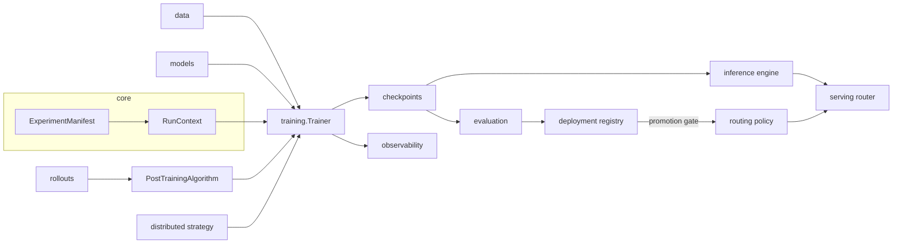
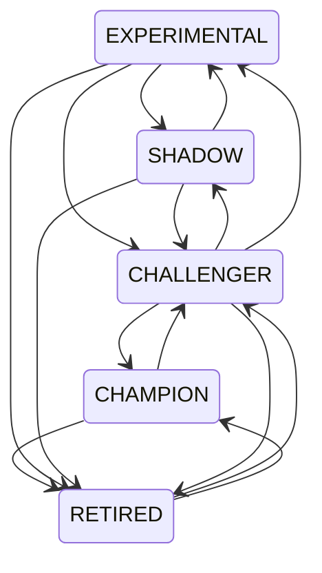

# Forgeline — Complete Guide

The single reference for Forgeline: every subsystem, configuration option, command, API, measured result, failure mode and limitation.

## Contents

1. [Overview](#1-overview)
2. [Installation and quick start](#2-installation-and-quick-start)
3. [Architecture](#3-architecture)
4. [Configuration](#4-configuration)
5. [Data](#5-data)
6. [Models](#6-models)
7. [Training](#7-training)
8. [Post-training overview](#8-post-training-overview)
9. [RLHF: reward models, DPO, PPO, GRPO, DAPO, AI feedback](#9-rlhf-reward-models-dpo-ppo-grpo-dapo-ai-feedback)
10. [RLVR: verifiers, tools, process rewards, STaR, hill climbing](#10-rlvr-verifiers-tools-process-rewards-star-hill-climbing)
11. [Distributed execution](#11-distributed-execution)
12. [Orchestration (optional Ray backend)](#12-orchestration-optional-ray-backend)
13. [Checkpointing and recovery](#13-checkpointing-and-recovery)
14. [Evaluation](#14-evaluation)
15. [Quantization and export](#15-quantization-and-export)
16. [Inference](#16-inference)
17. [Serving](#17-serving)
18. [Deployment: registry, gates, rollout, rollback](#18-deployment-registry-gates-rollout-rollback)
19. [Observability](#19-observability)
20. [Dashboard](#20-dashboard)
21. [Synthesis domain](#21-synthesis-domain)
22. [Testing](#22-testing)
23. [Command-line reference](#23-command-line-reference)
24. [Python API reference](#24-python-api-reference)
25. [Benchmark results](#25-benchmark-results)
26. [Troubleshooting](#26-troubleshooting)
27. [Hardware requirements and limitations](#27-hardware-requirements-and-limitations)
28. [Repository structure](#28-repository-structure)

## 1. Overview


Forgeline covers the full path from raw text to a served, gated and reversible model:

```
data ─► pretraining ─► SFT / LoRA / QLoRA ─► preference data + reward models ─► DPO
     ─► PPO / GRPO / DAPO / RLVR (tools, verifiers, process rewards) ─► AI feedback, STaR, hill climbing
     ─► distributed execution ─► checkpoints + recovery ─► evaluation + regression gates
     ─► quantization / GGUF export ─► KV-cached continuous-batching inference ─► OpenAI-compatible serving
     ─► candidate registry ─► champion / challenger rollout ─► rollback, with structured observability throughout
```

Every stage is driven by one experiment manifest, runs through one trainer lifecycle, writes one checkpoint format and emits one metric/event stream.

### Why This Framework Exists

Post-training work usually lives in disconnected scripts: each algorithm with its own loop, checkpoint layout and logging, evaluation that does not feed deployment decisions, and serving that knows nothing about which model should win. Forgeline makes those seams explicit contracts — `PolicyModel`, `RewardProvider`, `Verifier`, `PostTrainingAlgorithm`, `DistributedStrategy`, `EvaluationResult`, `ModelCandidate` — so algorithms stay small, results are comparable, and a model moves from training to traffic through auditable gates.

It is designed to be verifiable without GPUs: a 0.1M-parameter preset exercises every algorithm, the inference engine, the server and the lifecycle on CPU, while hardware-dependent paths are covered by tests that skip cleanly when CUDA is absent.

### Capabilities

| Area | Capabilities |
|---|---|
| Models | decoder-only transformer; multi-head and grouped-query attention; multi-head latent attention with compressed KV cache; native sparse attention; RoPE with linear/YaRN scaling; SwiGLU/GELU; sliding-window and alternating layers; logit soft-capping; mixture of experts (shared experts, aux-loss-free and group-limited routing); multi-token prediction; gradient checkpointing |
| Generation | temperature, top-k, top-p, min-p, repetition penalty, stop tokens, KV cache, speculative decoding (draft model and self-drafting MTP heads) |
| Efficiency | fp16/bf16 autocast, gradient scaler, LoRA, QLoRA with NF4 base weights, 8-bit loading (HuggingFace), gradient accumulation, FSDP, GGUF FP16/Q8_0/Q4_0 |
| Training | pretraining (memmap, sharded, text-glob and HuggingFace streaming), SFT with prompt masking, distillation (logit KL + feature matching) |
| Post-training | reward models, DPO (sum / length-normalised / reference-free), PPO, GRPO, agent GRPO with tools, process-reward GRPO, critic-augmented rewards, DAPO, RLVR, AI-feedback self-judge DPO, pairwise judging, constitutional critique→revise, STaR, hill climbing |
| Rewards & verifiers | math, exact match, tagged final answer, code execution, format; rule, composite, process, critic and learned-model rewards |
| Distributed | single, DDP (every algorithm, including RL), FSDP, DeepSpeed ZeRO, tensor parallel, pipeline parallel (1F1B), 3-D mesh |
| Orchestration (optional) | Ray worker pools for rollout generation, reward/verifier scoring, sandboxed tools and sharded evaluation; placement groups, weight sync from the learner, worker replacement and bounded retries |
| Reliability | atomic directory checkpoints with manifests, validation, latest discovery, bit-for-bit resume, typed actionable errors |
| Evaluation | held-out loss/perplexity, verifier pass rate, malformed-output rate, agent accuracy and tool use, reward statistics, preference win rate, latency/throughput/memory, MMLU/HellaSwag/ARC/GSM8K/TruthfulQA/HumanEval, regression rules |
| Inference & serving | continuous batching, paged block allocation, request lifecycle and cancellation, `/health`, `/v1/models`, `/v1/completions`, `/v1/chat/completions`, SSE streaming, `/metrics` |
| Lifecycle | candidate registry (experimental → shadow → challenger → champion → retired), fail-closed promotion gates, feature flags, deterministic champion/challenger/shadow routing, offline replay, rollback, kill switch |
| Observability | structured logs, local JSONL metrics and events, W&B and TensorBoard sinks, spans, gradient norms, serving metrics; optional local dashboard over runs, checkpoints, evaluations, the registry, benchmark evidence and model internals (attention, activations, weights) |


## 2. Installation and quick start

```bash
git clone <repository-url> forgeline && cd forgeline
python -m venv .venv && source .venv/bin/activate
pip install -e ".[dev]"

python -m pytest tests                                    # CPU: GPU-only tests skip with reasons
forgeline data prepare --input data/samples/text/tiny_corpus.txt --output data/prepared/tiny --tokenizer char
forgeline train configs/training/pretrain_tiny_cpu.yaml
forgeline generate --checkpoint runs/pretrain-tiny-cpu/checkpoints/final --prompt "The quick" --max-tokens 40
```

Optional extras:

```bash
pip install -e ".[training]"        # tiktoken, tqdm
pip install -e ".[huggingface]"     # transformers, datasets, peft, accelerate
pip install -e ".[distributed]"     # deepspeed
pip install -e ".[serving]"         # fastapi, uvicorn
pip install -e ".[observability]"   # wandb, tensorboard
pip install -e ".[chemistry]"       # rdkit (molecular fingerprints)
pip install -e ".[ray]"             # ray (optional orchestration backend)
```

`scripts/local_validation.sh` runs the tests and a CPU pipeline (pretrain → SFT → DPO → RLVR → evaluate → export).

## 3. Architecture

#### What

Forgeline is a single Python package (`forgeline`) that covers the language-model lifecycle: data preparation, pretraining, supervised and parameter-efficient fine-tuning, preference optimisation, reinforcement learning (with learned, verifiable and process rewards), distributed execution, checkpointing, evaluation, quantization and export, KV-cached inference, OpenAI-compatible serving, and a model-candidate lifecycle with promotion gates, staged rollout and rollback.

#### Why

Post-training systems fail at the seams: a DPO script that saves checkpoints differently from the SFT script, an RL loop with its own optimizer handling, an evaluator whose metric names do not match the promotion policy. Forgeline puts every stage behind the same small set of contracts so the output of one stage is the input of the next without glue code.

#### How



##### Package layout

| Package | Responsibility |
|---|---|
| `core` | `ModelSpec` + presets, `TrainerConfig`, `ExperimentManifest` (YAML/TOML/JSON), protocols, registry, runtime (device, dtype, seeding, RNG state), `RunContext`, typed errors |
| `observability` | structured logging, metrics sinks (local JSONL, no-op, W&B, TensorBoard), lifecycle events, timing spans |
| `data` | tokenizers (char, tiktoken, HuggingFace), record schemas with validation, memmap corpora, streaming/sharding, SFT/preference/verifiable datasets, collators, preprocessing |
| `models` | decoder-only transformer, attention variants (GQA/MHA, latent, native sparse), MoE, multi-token prediction, sampling and speculative decoding, LoRA/QLoRA, NF4, GGUF export, policies (native + HuggingFace), reward model, loading |
| `training` | shared `Trainer` lifecycle and numerical utilities; pretraining, SFT, distillation, reward modelling, DPO, PPO, GRPO (single-turn, tool agent, REINFORCE), DAPO, RLVR, AI-feedback (self-judge, pairwise, constitutional), STaR, hill climbing; `factory` builds any stage from a manifest |
| `rollouts` | rollout engine, multi-turn agent engine, tools (Python executor, tag parser), verifiers, reward providers |
| `distributed` | process-group runtime, 3-D mesh, tensor-parallel layers, pipeline stages + 1F1B schedule, strategies (single, DDP, FSDP, DeepSpeed, tensor, pipeline) |
| `checkpoints` | directory checkpoints with manifest, atomic writes, validation, discovery, resume |
| `evaluation` | structured results, quality/reward/performance suites, standard benchmarks, regression rules, model inspection |
| `inference` | requests, paged block allocator, continuous-batching scheduler, KV-cached engine |
| `serving` | request schemas, backends, transport-agnostic router, HTTP server |
| `deployment` | candidates and states, JSON registry, promotion gates, feature flags, routing policy, rollback |
| `domains.synthesis` | pharmaceutical-synthesis task family: rule reward, constraints, prompt/condition codec, features, preference construction, simulated data, tabular actor-critic PPO |
| `cli` | `forgeline` command |

##### Core contracts

| Contract | Defined in | Implemented by |
|---|---|---|
| `PolicyModel` | `core/protocols.py` | `NativePolicy`, `HFPolicy` |
| `RewardProvider` | `core/protocols.py` | rule, verifier, composite, process, critic, reward-model, synthesis rewards |
| `Verifier` | `core/protocols.py` | math, exact match, tagged answer, code execution, format |
| `Trajectory` | `core/protocols.py` | produced by `RolloutEngine` / `AgentRolloutEngine` |
| `PostTrainingAlgorithm` | `training/common/trainer.py` | every step-based training stage |
| `DistributedStrategy` | `core/protocols.py` | `distributed/strategies.py` |
| `EvaluationSuite` → `EvaluationResult` | `core/protocols.py` | `evaluation/*` |
| `MetricsSink` | `observability/metrics.py` | local / no-op / W&B / TensorBoard |

##### Training lifecycle

`Trainer.train_step()` for every algorithm:

1. set the learning rate from the schedule;
2. `algorithm.collect(step)` — sample batch or run rollouts;
3. for each gradient-accumulation micro-step: `algorithm.loss(batch, i, n)` under autocast, reject non-finite loss, backward through the gradient scaler;
4. unscale and clip gradients; optimizer step;
5. log metrics; periodic evaluation, checkpointing and best-checkpoint tracking in `fit()`.

Algorithms own only their mathematics. Optimizer construction (matrix-only weight decay), precision, clipping, checkpoint format, RNG capture and events are identical across stages.

#### Configuration

Every run is described by an `ExperimentManifest`; see [configuration](configuration.md) and the examples in `configs/`. `forgeline validate <manifest>` checks a manifest (including distributed topology) without running it.

#### Failure modes

All errors derive from `ForgelineError` and carry a `hint`. Unknown configuration keys are rejected rather than ignored.

#### Local validation

`python -m pytest tests` (CPU) and `scripts/local_validation.sh`.

#### Hardware requirements

CPU for everything at tiny scale. CUDA for bf16/fp16 training at scale, FSDP, NCCL tensor/pipeline parallelism and DeepSpeed.

#### Limitations

See the Limitations section of each subsystem document.


## 4. Configuration

#### What

`ExperimentManifest` is the reproducible record of a run: model, tokenizer, dataset, algorithm and its parameters, seed, precision, adapters, distributed strategy, optimizer, schedule, batch size, gradient accumulation, checkpoint settings, evaluation suites, reward/verifier settings and runtime environment.

#### Why

One human-readable file (YAML, TOML or JSON) reproduces any run, is saved next to its outputs, and is embedded in every checkpoint.

#### How

```yaml
name: dpo-tiny-cpu
algorithm: dpo                 # pretrain sft distill reward_model dpo ppo grpo dapo rlvr (+ rlaif constitutional star hill_climb tabular_ppo via CLI)
model_preset: tiny             # optional; `model` values override preset values
model: {block_size: 64, dropout: 0.0}
checkpoint_path: ""            # initialise from a checkpoint directory
data:
  kind: preference
  path: data/samples/preference/arithmetic_pairs.jsonl
  tokenizer: char
  val_fraction: 0.1
  max_length: 16
  seed: 1337
  extra: {}
trainer:
  max_steps: 60
  batch_size: 4
  gradient_accumulation_steps: 1
  eval_every: 20
  eval_batches: 20
  log_every: 10
  seed: 1337
  device: auto                 # auto | cpu | cuda | mps
  compile_model: false          # torch.compile trained modules in place
  compile_backend: inductor      # inductor | eager | aot_eager
  gradient_checkpointing: false
  optimizer: {name: adamw, learning_rate: 5.0e-4, weight_decay: 0.01, beta1: 0.9, beta2: 0.95, eps: 1.0e-8, grad_clip: 1.0, decay_only_matrices: true, fused: auto}
  schedule: {name: cosine, warmup_steps: 100, decay_steps: 5000, min_lr: 3.0e-5, wsd_stable_fraction: 0.8}   # cosine | wsd | constant | linear_decay
  precision: {dtype: auto, grad_scaler: auto}   # auto → bf16 on capable CUDA, fp16 on other CUDA, fp32 elsewhere
  checkpoint: {directory: checkpoints, save_every: 1000, keep_last: 3, async_save: false, resume_from: "", auto_resume: true}
  adapter: {method: none, rank: 16, alpha: 32.0, dropout: 0.0, target_modules: [], merge_on_save: false}
distributed: {strategy: single, backend: auto, tensor_parallel_size: 1, pipeline_parallel_size: 1, pipeline_micro_batches: 4, fsdp_min_params_to_wrap: 100000, deepspeed_config: ""}
orchestration: {}              # optional: {type: ray, rollout_workers, reward_workers, ...} — see orchestration.md
backend: {}                    # native model; or {type: huggingface, model_name: ..., lora_r, lora_alpha, lora_dropout, target_modules, load_in_8bit, torch_dtype, gradient_checkpointing}
algorithm_params: {beta: 0.1, logprob_reduction: sum}
reward: {}                     # see rlhf.md / rlvr.md
evaluation: []
output_dir: runs/dpo-tiny-cpu
tags: []
```

* Unknown keys at any level raise `ConfigError`.
* `forgeline train m.yaml --set trainer.max_steps=10 --set algorithm_params.beta=0.2` applies dotted overrides (values parsed as YAML).
* `forgeline train` writes `<output_dir>/manifest.yaml` with the captured runtime environment (Python, platform, torch, CUDA availability and devices).

##### Policy backend

With `backend.type: huggingface` the SFT, DPO, PPO, GRPO (including agent mode), DAPO and RLVR stages run on a HuggingFace causal LM with PEFT LoRA; `checkpoint_path` restores adapter (and value-head) state from a Forgeline checkpoint. `scripts/export_adapter.py` writes the adapter as a PEFT directory and can publish it to the Hub.

##### Data kinds

`pretraining` (token directory), `supervised`, `preference`, `verifiable` (JSONL), and `trajectories` (synthesis records): SFT uses records with rule reward ≥ `extra.reward_threshold`; DPO builds per-molecule yield preference pairs (`extra.pairs_per_molecule`) from the first `extra.train_fraction` (default 0.8) of records; PPO/GRPO/DAPO prompt with the synthesis template and score generated conditions with `reward: {type: synthesis_rule}`.

##### Rollout parameters

`algorithm_params.rollout` configures sampling for PPO/GRPO/DAPO/RLVR: `group_size`, `max_new_tokens`, `temperature`, `top_k`, `top_p`, `max_prompt_length`, `record_old_logprobs`, `stop_token_ids`.

##### Provided manifests

| Directory | Files |
|---|---|
| `configs/models` | `tiny`, `small`, `large`, `latent_moe` |
| `configs/training` | pretraining (tiny CPU, small char, large GPU), SFT, LoRA, QLoRA, distillation |
| `configs/post_training` | CPU: reward model, DPO, length-normalised DPO, PPO, GRPO, agent GRPO with tools, process-reward GRPO, DAPO, RLVR. GPU (7B LoRA): synthesis SFT/DPO/PPO/GRPO/DAPO, agent GRPO on GSM8K |
| `configs/distributed` | single, DDP, FSDP, 3-D tensor×pipeline, DeepSpeed (+ ZeRO-2 JSON) |
| `configs/inference`, `configs/evaluation` | server defaults, offline benchmark set |
| `configs/deployment` | promotion gate, champion/challenger routing policy |
| `configs/sweeps` | W&B Bayesian sweep for DPO |

#### Failure modes

`ConfigError` for invalid values, unknown keys, unknown algorithms and presets; `DistributedConfigError` for topologies that do not tile the world size.

#### Local validation

`forgeline validate <manifest> [--world-size N]`; `tests/integration/test_cli_pipeline.py` validates every shipped manifest.

#### Limitations

Manifests do not include variable interpolation or includes; compose with `--set`.


## 5. Data

#### What

Tokenizers, record schemas, datasets and collators for every training stage: pretraining token corpora, SFT pairs, preference pairs, reward-model data, verifiable tasks and process-reward records.

#### Why

Every downstream algorithm assumes clean, typed input. Validation at load time turns a silent training problem (an empty `chosen`, a missing answer, a label list of the wrong length) into an error that names the file and line.

#### How

##### Tokenizers (`data/tokenizers.py`)

| Spec | Class | Notes |
|---|---|---|
| `char` | `CharTokenizer` | fitted on a corpus, or `CharTokenizer.ascii()` (97 symbols); dependency-free |
| `tiktoken[:encoding]` | `TiktokenTokenizer` | `training` extra |
| `hf:<name>` | `HFTokenizer` | `huggingface` extra |
| `auto` | from `meta.pkl` | written next to token files and embedded in checkpoints |

Token files use `uint16` when the vocabulary fits (≤ 65,535) and `uint32` otherwise (`token_dtype_for`, `detect_token_dtype`).

##### Record schemas (`data/records.py`)

| Kind | Class | Required fields |
|---|---|---|
| supervised | `SFTRecord` | `prompt`, `response` (aliases `completion`, `target`) |
| preference | `PreferenceRecord` | `prompt`, `chosen`, `rejected` (chosen ≠ rejected) |
| verifiable | `VerifiableTask` | `prompt` (alias `problem`, `question`) and `answer` or `test_code`; optional `tools`, `task_type` |
| process | `ProcessRecord` | `prompt`, `steps`, `step_labels` (same length, finite) |
| reward | `RewardRecord` | `text`, finite `score` |

`read_jsonl(path, schema, on_error="raise"|"skip", report=ReadReport())` validates every line. Extra keys are preserved in `meta`.

`deterministic_split(items, val_fraction, seed)` produces identical splits for identical inputs.

##### Datasets

| Class | Kind | Behaviour |
|---|---|---|
| `MemmapCorpus` | pretraining | random `(x, y)` windows of `block_size` from `<split>.bin`; seeded via `torch.Generator` |
| `ShardedTokenDataset` | pretraining | streams `shard_*.bin`, splits shards by rank and DataLoader worker |
| `TextGlobDataset` | pretraining | tokenizes raw text files on the fly |
| `HFStreamingDataset` | pretraining | streams a HuggingFace dataset, packs tokens (`huggingface` extra) |
| `SupervisedDataset` | supervised | tokenized `(prompt_ids, response_ids)`, response truncated to fit `max_length` |
| `PreferenceDataset` | preference | tokenized prompt (left-truncated) + chosen/rejected (right-truncated) |
| `VerifiableTaskDataset` | verifiable | tasks from JSONL or the built-in arithmetic set |

##### Preprocessing

* `prepare_text_corpus(input, output, tokenizer, val_fraction)` → `train.bin`, `val.bin`, `meta.pkl`.
* `write_shards_from_documents(...)` → fixed-size shards with a pre-allocated buffer (constant memory), first shard as validation, then merged `train.bin`/`val.bin`.
* `prepare_hf_corpus(...)` — the same for a streamed HuggingFace dataset.
* `shard_token_file(input, output, n)` — split an existing token file.
* `build_gsm8k_tool_dataset(output)` — GSM8K as tool-use verifiable tasks.

##### Collators

`collate_supervised` produces next-token `input_ids`/`targets` with prompt tokens and padding set to `IGNORE_INDEX = -1`. `pad_sequences` supports left/right padding with an attention mask. `collate_preference` pads prompt (left) and responses (right).

#### Configuration

```yaml
data:
  kind: supervised          # pretraining | supervised | preference | reward | verifiable | process
  path: data/samples/supervised/arithmetic_sft.jsonl
  tokenizer: char           # auto | char | tiktoken[:enc] | hf:<name>
  val_fraction: 0.1
  max_length: 48
  seed: 1337
  extra: {on_error: skip, max_prompt_length: 384, limit: 100}
```

CLI: `forgeline data prepare|prepare-hf|shard|gsm8k|validate`.

#### Failure modes

| Condition | Error |
|---|---|
| missing file | `DatasetError` |
| invalid JSON / wrong field types / identical chosen & rejected | `MalformedRecordError` with `path:line` |
| corpus shorter than `block_size + 1` | `DatasetError` |
| missing `meta.pkl` for `tokenizer: auto` | `TokenizerError` |
| optional backend not installed | `OptionalDependencyError` naming the extra |

#### Local validation

`tests/unit/test_data.py` covers tokenizers, memmap sampling, deterministic splits, schema validation, collators, packing and sharding. `forgeline data validate --input f.jsonl --kind preference` reports valid/skipped counts.

#### Hardware requirements

CPU. Streaming large HuggingFace corpora needs network access and disk for shards (about 4 bytes per token with `uint32`).

#### Limitations

* `CharTokenizer` drops characters outside its vocabulary on encode.
* Shard shuffling is per-epoch within a process; there is no global cross-rank shuffle buffer.


## 6. Models

#### What

A native decoder-only transformer (`TransformerLM`) with configurable attention, feed-forward, mixture-of-experts and multi-token prediction; sampling and speculative decoding; LoRA and QLoRA adapters; and two policy backends that expose the same interface to training code.

#### Why

A readable, dependency-free model makes every algorithm testable on a laptop CPU, while the HuggingFace backend runs the same algorithms on pretrained checkpoints.

#### How

##### Architecture options (`ModelSpec`)

| Feature | Fields | Implementation |
|---|---|---|
| Pre-norm RMSNorm blocks, tied embeddings | — | `transformer/block.py`, `transformer/norm.py` |
| Multi-head / grouped-query attention | `n_head`, `n_kv_head` | `attention/causal.py` (SDPA fast path when no cache/window/cap) |
| Rotary embeddings + linear / YaRN scaling | `use_rope`, `rope_scaling_type`, `rope_scaling_factor` | `attention/rotary.py` |
| Learned absolute positions | `use_rope: false` | `TransformerLM.wpe` |
| Sliding-window attention, alternating global/local layers | `sliding_window`, `alternating_layers` | `attention/causal.py` |
| Attention logit soft-capping | `attn_logit_cap` | all attention modules |
| Multi-head latent attention (compressed KV cache, decoupled RoPE, absorbed decode) | `use_mla`, `kv_lora_rank`, `q_lora_rank`, `qk_nope_head_dim`, `qk_rope_head_dim`, `v_head_dim` | `attention/latent.py` |
| Native sparse attention (compressed + top-k + window branches with learned gates) | `use_nsa`, `nsa_block_size`, `nsa_top_k`, `nsa_window_size` | `attention/sparse.py` |
| SwiGLU or GELU FFN | `use_swiglu` | `transformer/feedforward.py` |
| Mixture of experts: softmax/sigmoid gates, top-k, shared experts, auxiliary-loss or bias-based (aux-loss-free) balancing, group-limited routing, first N dense layers | `use_moe`, `n_experts`, `n_experts_active`, `n_shared_experts`, `score_func`, `aux_loss_free`, `bias_update_speed`, `n_expert_groups`, `n_limited_groups`, `n_dense_layers` | `moe/gate.py`, `moe/layer.py` |
| Multi-token prediction heads | `n_predict_tokens`, `mtp_loss_weight` | `transformer/block.py::MTPModule` |
| Gradient checkpointing | `trainer.gradient_checkpointing` | `TransformerLM.enable_gradient_checkpointing` |

Presets (`forgeline presets --count-params`): `tiny`, `small`, `medium`, `large`, `xl`, `moe_32l`, `latent_moe_27l`, `sliding_window_32l`, `alternating_28l`.

##### Forward APIs

* `forward(idx, targets)` → `(logits, loss)`; loss = token cross-entropy (`ignore_index=-1`) + MoE auxiliary losses + weighted MTP losses.
* `forward_hidden(idx)` → final hidden states.
* `full_logits(idx)` → logits at every position.
* `prefill(idx)` / `step(next_ids, cache, position)` → incremental decoding with per-layer caches (`(k, v)` for GQA, `(latent, k_rope)` for MLA).

##### Generation

`models/generation/sampling.py`: temperature (0 = greedy), top-k, top-p, min-p, repetition penalty, stop tokens, optional sampled-token log-probs. The cached and uncached paths produce identical greedy outputs (tested).

`models/generation/speculative.py`: `SpeculativeGenerator` (draft model proposes `k` tokens, target verifies in one pass with rejection sampling; exposes acceptance rate) and `MTPSpeculativeGenerator` (the model's own MTP heads draft).

##### Adapters and quantization

* `apply_lora(model, rank, alpha, dropout, target_modules)` wraps matching `nn.Linear` layers: `y = Wx + (x·A·B)·α/r`, `A` Kaiming-initialised, `B` zero (identity at init). `merge_lora`, `save_lora`/`load_lora`, `set_lora_enabled`, `trainable_parameter_report`.
* `apply_qlora` stores base weights as NF4 (`NF4Linear`: 16-level normal-float table, block size 64, two indices per byte, per-block abs-max) and trains full-precision LoRA on top. `quantization_report` gives the compression ratio.
* Details: [quantization](quantization.md).

##### Policies (`models/policy.py`)

| | `NativePolicy` | `HFPolicy` |
|---|---|---|
| Model | `TransformerLM` | `AutoModelForCausalLM` (+ PEFT LoRA) |
| Reference policy | adapters disabled, or frozen deep copy (`with_frozen_reference`) | `disable_adapter()` |
| Log-probs | `cross_entropy` over response positions | same |
| Value head | optional `ValueHead` on last hidden state | same |
| Extra | — | `huggingface` extra; 8-bit loading; gradient checkpointing |
| Manifest | default | `backend: {type: huggingface, model_name: …}` |

##### Reward model

`SequenceRewardModel(spec, pooling="last"|"mean")` — transformer backbone + scalar head; `bradley_terry_loss(chosen, rejected) = −log σ(r_c − r_r)`.

`EncoderRewardModel(backbone, objective="regression"|"preference")` (`huggingface` extra) scores text with a Transformer encoder: regression fits a sigmoid head with MSE to scalar targets (for example rule-reward pseudo-labels, `fit_regression`); preference fits a linear head with the Bradley-Terry loss on (chosen, rejected) texts (`fit_preference`). Combine with rules through `BlendedReward`.

##### Loading

`load_model_from_checkpoint`, `load_policy_from_checkpoint`, `load_reward_model_from_checkpoint` rebuild models from checkpoint manifests (the spec and tokenizer metadata are stored inside the checkpoint). `torch.compile` prefixes are stripped.

#### Configuration

```yaml
model_preset: tiny
model: {block_size: 64, dropout: 0.0, n_kv_head: 1}
trainer:
  adapter: {method: lora, rank: 8, alpha: 16.0, dropout: 0.05, target_modules: [q_proj, v_proj]}
  gradient_checkpointing: true
```

#### Failure modes

| Condition | Error |
|---|---|
| inconsistent spec (e.g. `n_embd % n_head`, MLA+NSA) | `ConfigError` at construction |
| sequence longer than `block_size` | `ValueError` / `ModelError` |
| no layers match adapter targets | `ModelError` |
| state dict does not fit the model | `IncompatibleStateError` |
| HuggingFace backend without extra | `OptionalDependencyError` |

#### Local validation

`tests/unit/test_models.py` runs forward, backward and generation for every attention/FFN/MoE/MTP/RoPE variant, checks cached = uncached decoding, sampling filters and both speculative generators. `tests/unit/test_adapters_quantization.py` checks LoRA identity-at-init, enable/disable, save/load, merge, NF4 round trips and QLoRA gradients.

#### Hardware requirements

All variants run on CPU at tiny sizes. Large presets require GPUs; `moe_32l`, `latent_moe_27l`, `sliding_window_32l` and `alternating_28l` are multi-GPU scale.

#### Limitations

* Native sparse attention has no incremental-decode cache path; it runs full-sequence forwards.
* The MoE layer dispatches experts with a Python loop (clear, not throughput-optimised).
* Sliding-window cached decoding masks by position but keeps the full cache in memory.


## 7. Training

#### What

The shared training lifecycle (`Trainer`) and the supervised stages built on it: language-model pretraining, supervised fine-tuning (full, LoRA, QLoRA) and knowledge distillation.

#### Why

Optimizer grouping, schedules, precision, accumulation, clipping, checkpointing and metrics are identical for every stage; algorithms supply only data collection and the loss.

#### How

##### Trainer

`Trainer(ctx, algorithm, config=None, checkpoint_manager=None, strategy=None)`

* **Optimizer** — AdamW (or Adam) with weight decay applied only to parameters with `dim >= 2` (`decay_only_matrices`); fused kernels on CUDA.
* **Schedules** (`training/common/schedule.py`):
  * `cosine` — linear warmup to peak, cosine decay to `min_lr` at `decay_steps`, then flat;
  * `wsd` — warmup, stable at peak until `decay_steps × wsd_stable_fraction`, cosine decay to `min_lr`;
  * `constant`, `linear_decay`.
* **Precision** — autocast bf16/fp16 on CUDA (bf16 also on CPU when requested); `GradScaler` enabled automatically for fp16.
* **Accumulation** — `gradient_accumulation_steps` micro-batches per optimizer step; each micro loss divided by the count.
* **Clipping** — global-norm clipping at `grad_clip` (0 disables) after unscaling.
* **Safety** — non-finite losses abort the run with `ConfigError` and a `run.failed` event.
* **Evaluation** — every `eval_every` steps and at the end; when a `loss` (or `primary`) metric improves, a `best_candidate` checkpoint is saved.
* **Checkpoints** — every `save_every` steps and `final` at the end; RNG, optimizer, scaler and trainer state are included. `resume(path=None)` loads an explicit path or the latest checkpoint and validates spec and algorithm.

##### Pretraining (`training/pretrain.py`)

`PretrainAlgorithm(model, train_corpus, PretrainConfig(batch_size, eval_batches, seed), val_corpus)`: random windows from `MemmapCorpus` (or batches from a streaming loader); loss = model cross-entropy; logs EMA loss and tokens seen; evaluation reports `train_loss`, `val_loss`.

##### Supervised fine-tuning (`training/sft.py`)

`SFTAlgorithm(policy, SupervisedDataset, SFTConfig(batch_size, max_length, mask_prompt, seed))`: epoch-shuffled batches, token cross-entropy on response tokens only (prompt and padding masked). With `trainer.adapter.method: lora|qlora` only adapter parameters train; base weights stay frozen (tested).

##### Distillation (`training/distill.py`)

`DistillationAlgorithm(student, teacher, corpus, DistillConfig(temperature, alpha, batch_size, feature_weight))`:

`L = α · T² · KL(softmax(teacher/T) ‖ softmax(student/T)) + (1 − α) · CE(student, labels)` plus optional `feature_weight · MSE(proj(student_hidden_l), teacher_hidden_l)` across layers. Student and teacher must share a vocabulary.

##### Mixed precision and memory

| Mechanism | How to enable |
|---|---|
| bf16 / fp16 autocast | `trainer.precision.dtype` |
| gradient scaler | automatic for fp16 (`grad_scaler: on|off|auto`) |
| gradient checkpointing | `trainer.gradient_checkpointing: true` |
| gradient accumulation | `trainer.gradient_accumulation_steps` |
| LoRA / QLoRA (NF4 base) | `trainer.adapter` |
| sharding | `distributed.strategy: fsdp|deepspeed` |
| torch.compile | `trainer.compile_model: true`, `trainer.compile_backend: inductor|eager|aot_eager` — each trained module is compiled in place (`nn.Module.compile`), so state-dict keys and checkpoints are unchanged |
| merged adapter checkpoint | `trainer.adapter.merge_on_save: true` writes `final_merged` (LoRA folded into base weights) next to `final` |

#### Configuration

`configs/training/*.yaml`. Command: `forgeline train <manifest> [--max-steps N] [--resume PATH] [--metrics local|none|wandb|tensorboard]`.

#### Failure modes

Non-finite loss, empty datasets, missing corpora, spec/algorithm mismatch on resume, and missing checkpoints raise typed errors (see [checkpointing](checkpointing.md)).

#### Local validation

`tests/integration/test_training_lifecycle.py` (pretraining loss decreases; SFT full/LoRA/QLoRA with frozen base; distillation) and `tests/integration/test_checkpoint_resume.py` (save at step 3, reload, continue — losses match uninterrupted training to 1e-5; compiled training with the eager backend produces losses identical to uncompiled training and reloadable checkpoints; `merge_on_save` produces a plain checkpoint whose logits equal the adapter model's).

#### Hardware requirements

Tiny presets: CPU. `large` pretraining with batch 8 × 2048 tokens in bf16 used about 42 GB on a 46 GB GPU (see `benchmarks/training/fineweb_edu_large_a40`).

#### Limitations

* `torch.compile` is not combined with FSDP wrapping.
* Streaming loaders are consumed sequentially; resuming does not fast-forward a streaming iterator.


## 8. Post-training overview

#### What

Preference optimisation, reward modelling, reinforcement learning and self-improvement methods, all implemented as `PostTrainingAlgorithm`s (or loops built from them):

| Method | Module | Summary |
|---|---|---|
| Reward model | `training/reward_model.py` | Bradley-Terry on preference pairs |
| DPO | `training/dpo.py` | direct preference optimisation (sum or length-normalised; optional reference-free, label smoothing) |
| PPO | `training/ppo.py` | clipped policy gradient with value head, KL and entropy options |
| GRPO | `training/grpo.py` | group-relative advantages, no value model; single-turn, tool-agent and REINFORCE modes |
| DAPO | `training/dapo.py` | clip-higher, dynamic sampling, token-level loss, overlong shaping, entropy bonus |
| RLVR | `training/rlvr.py` | GRPO/DAPO driven by verifiers |
| Process-reward GRPO | `grpo` + `ProcessReward` | dense step-level rewards |
| Critic-augmented agent GRPO | `grpo` + `CompositeReward(verifier, CriticReward)` | verifiable + heuristic/LLM critic reward |
| AI feedback | `training/rlaif.py` | self-judge rounds → reference-free DPO; pairwise judge → preference data; constitutional critique→revise |
| STaR | `training/star.py` | rejection-sampled rationales → SFT, repeated |
| Hill climbing | `training/star.py` | rejection-sample high-reward tool trajectories into the dataset, then agent GRPO rounds |

Details: [RLHF](rlhf.md) (reward models, DPO, PPO, GRPO, DAPO, AI feedback) and [RLVR](rlvr.md) (verifiers, tools, process rewards, STaR, hill climbing).

#### Why

These methods share rollouts, rewards, reference policies and optimisation machinery; implementing them against one policy interface and one trainer keeps their mathematics isolated and comparable.

#### How

Every step-based method follows: `collect` (sample prompts/pairs, run rollouts, score, compute advantages, record old/reference log-probs) → `loss` (objective) → shared `Trainer` step. Reference policies are LoRA-disabled views when adapters are used, otherwise frozen copies.

#### Configuration

`configs/post_training/*.yaml`; `forgeline train <manifest>`. AI-feedback data generation: `forgeline rlaif pairwise|constitutional`.

#### Failure modes

Invalid rewards (NaN/inf) raise `InvalidRewardError`; verifier exceptions become failed results; generation failures raise `RolloutError`; zero-variance groups are skipped (DAPO, or GRPO with `skip_zero_variance_groups`) and yield a zero loss that keeps autograd consistent.

#### Local validation

`tests/integration/test_training_lifecycle.py` runs every method on the tiny model: DPO raises the preference margin and reaches accuracy 1.0 on a toy set; the reward model ranks chosen above rejected; PPO in three configurations; GRPO in three configurations; agent GRPO with the tool loop; DAPO dynamic sampling; RLVR with format verification. `tests/unit/test_benchmark_semantics.py` pins the objectives behind recorded measurements.

#### Hardware requirements

CPU at tiny scale. 7B-class policies via `HFPolicy` require a GPU with enough memory for the base model plus LoRA states (fp16) or 8-bit loading.

#### Limitations

See [rlhf.md](rlhf.md#limitations) and [rlvr.md](rlvr.md#limitations).


## 9. RLHF: reward models, DPO, PPO, GRPO, DAPO, AI feedback

#### What

Learning from preferences and scalar rewards.

#### Why

Different alignment signals (human or AI preferences, learned rewards, rule rewards) need different estimators; a single rollout/reward interface lets them be swapped by configuration.

#### How

##### Rollout → reward → objective

```
prompt ──► RolloutEngine (G samples per prompt, old log-probs recorded)
       ──► RewardProvider.score(trajectory) → RewardResult(value, passed, components)
       ──► advantages (value baseline | group-relative | none)
       ──► objective ──► Trainer step
```

`Trajectory` holds prompt and response token ids, decoded text, the task record, agent segments/tool results, truncation flag and sampled-time log-probs.

##### Reward models

`RewardModelAlgorithm` trains `SequenceRewardModel` with `−log σ(r_chosen − r_rejected)` and reports pairwise accuracy. `RewardModelProvider` turns a trained model into a reward for RL. `BlendedReward` mixes a rule score and a neural score (`(1 − w)·rule + w·neural`, clipped to [0, 1]).

##### DPO

```
L = −log σ( β·(log π(y_w|x) − log π_ref(y_w|x)) − β·(log π(y_l|x) − log π_ref(y_l|x)) )
```

| Option | Values |
|---|---|
| `beta` | > 0 |
| `logprob_reduction` | `sum` (standard) · `mean` (length-normalised) |
| `reference_free` | drop reference terms |
| `label_smoothing` | conservative DPO in [0, 0.5) |

Metrics: implicit chosen/rejected rewards, margin, preference accuracy.

##### PPO

Value-head actor-critic. Advantages `A = normalise(r − V_old)`; loss per PPO epoch:

```
policy  = mean( −min(ρ·A, clip(ρ, 1−ε, 1+ε)·A) )
value   = MSE(V, r)
total   = policy + c_v·value − c_e·entropy (+ β·KL when kl_mode = penalty)
```

| Option | Values | Meaning |
|---|---|---|
| `ratio_level` | `sequence_mean` | `ρ = exp(mean_t(log π − log π_old))` per sequence |
| | `token` | `ρ_t` per token, loss averaged over response tokens |
| `kl_mode` | `monitor` | KL = mean(log π_old − log π_ref), logged only |
| | `penalty` | `β·clamp(mean(log π_ref − log π), 0)` added to the loss |
| | `reward` | `r ← r − β·mean(log π_old − log π_ref)` before advantages |
| `entropy_mode` | `sampled_logprob` | `−mean(log π(y_t))` |
| | `full` | exact entropy of the full distribution |

`compute_gae(rewards, values, γ, λ)` is available for per-token rewards.

##### GRPO

For each prompt, `G` completions; `A_i = (r_i − mean(r)) / (std(r) + ε)`.

| `objective` | Loss |
|---|---|
| `clipped` | `mean_i(−min(ρ_i·A_i, clip(ρ_i)·A_i)) + β·clamp(mean_i mean_t(log π_ref − log π), 0)` (`ratio_level` `sequence_mean` or `token`; `kl_estimator` `logprob_diff` or `k3`) |
| `reinforce` | `Σ_i −A_i · Σ_t log π(y_{i,t})` (no clipping, no KL) |

`agent: true` runs multi-turn tool episodes (see [RLVR](rlvr.md)).

##### DAPO

```
per-token surrogate  = −min(ρ_t·A, clip(ρ_t, 1−ε_low, 1+ε_high)·A)
loss = ( Σ_groups Σ_tokens surrogate + β·Σ(log π − log π_ref) − c_e·Σ entropy ) / total_response_tokens
```

* clip-higher (`clip_eps_high ≥ clip_eps_low`);
* dynamic sampling: groups with zero reward variance are skipped;
* overlong shaping: `r += overlong_penalty · max(0, len/max_len − 1)` for truncated responses;
* optional entropy bonus.

##### AI feedback

* **Self-judge rounds** (`RLAIFTrainer`): sample `K` candidates per task, score each with a 0–10 judge prompt (`parse_judge_score`), form pairs with score gap ≥ `pair_gap`, run reference-free DPO epochs; pairs written per round.
* **Pairwise judge** (`run_pairwise_rlaif`): all `K·(K−1)/2` comparisons, winner becomes `chosen`; policy-backed generator/judge (`make_policy_generator`, `make_policy_pairwise_judge`) or deterministic rule-based demo components.
* **Constitutional** (`run_constitutional`): initial response → per sampled principle critique → revision; outputs SFT records (final revision) and DPO records (revision ≻ initial). `score_critique_quality` checks critique substance.

#### Configuration

```yaml
algorithm: ppo
reward: {type: rule, name: length, target_length: 12}
algorithm_params:
  prompts_per_step: 4
  samples_per_prompt: 1
  ppo_epochs: 3
  clip_ratio: 0.2
  value_coef: 0.5
  entropy_coef: 0.01
  kl_coef: 0.1
  ratio_level: sequence_mean
  kl_mode: monitor
  entropy_mode: sampled_logprob
  rollout: {max_new_tokens: 16, temperature: 0.7}
```

Reward specifications (`rollouts/rewards/__init__.py::build_reward_provider`):

| `type` | Parameters |
|---|---|
| `rule` | `name: length|text_format|repetition|constant` + its parameters |
| `verifier` | `verifier: math|exact_match|tagged_answer|code|format`, `target_key`, `weight` |
| `composite` | `providers: [ {…, weight} ]`, optional `clip: [lo, hi]` |
| `tagged` | `format_bonus: true|false` |
| `process` | `gamma`, `step_weight`, `execute_code` |
| `critic` | `mode: heuristic` |

#### Failure modes

| Condition | Behaviour |
|---|---|
| reward NaN/inf | `InvalidRewardError` naming the provider |
| PPO policy without value head | `ConfigError` |
| GRPO/DAPO `group_size < 2` | `ConfigError` |
| DAPO `clip_eps_high < clip_eps_low` | `ConfigError` |
| all groups skipped | zero loss, `groups_skipped` metric |
| no reference policy for KL | `ConfigError` (policies create one automatically when needed) |

#### Local validation

See `tests/integration/test_training_lifecycle.py`, `tests/unit/test_training_utils.py` (closed-form checks of PPO clipping, DAPO clip-higher, DPO loss at 0 and large margins, Bradley-Terry, GAE, group advantages) and `tests/unit/test_benchmark_semantics.py`.

#### Hardware requirements

CPU for tiny policies. PPO holds policy, value head and reference log-probs; with LoRA the reference costs no extra parameters.

#### Limitations

* Rollouts are generated per prompt group rather than fully batched across prompts.
* PPO value estimates are per sequence (last hidden state); per-token GAE is provided as a utility, not wired into the default PPO loss.
* LLM-based judges and critics are only as reliable as the judging model.


## 10. RLVR: verifiers, tools, process rewards, STaR, hill climbing

#### What

Reinforcement learning where rewards come from deterministic checks — answer extraction, exact match, unit-test execution, output format, tool-use outcomes and step-level verification — instead of a learned model.

#### Why

Verifiable rewards cannot be reward-hacked the way learned rewards can, and they need no labelled preferences. Separating verification from generation lets any verifier drive any RL method.

#### How

##### Verifiers (`rollouts/verifiers`)

| Verifier | Target | Scoring |
|---|---|---|
| `math` | answer string | extracts `\boxed{}`, `#### x`, "the answer is", or last number; exact or numeric match (tolerance) → 1.0; within 1% relative error → 0.5 (partial credit); else 0.0 |
| `exact_match` | string | whitespace/case-normalised equality |
| `tagged_answer` | answer | `<final_answer>` numeric-normalised match → 1.0; tool call and tool result present → 0.1; else 0.0 |
| `code` | unit-test code | extracts fenced/indented code, appends tests, runs in a subprocess with timeout: pass 1.0, assertion failure 0.0, crash/timeout −0.1 |
| `format` | `cot` / `steps` / `json` | `<think>` structure, step count, JSON validity (graded) |

Verifier exceptions never propagate: they return `passed=False` with `info.error`.

`tag_format_reward` adds 0.02 per `<think>`, `<tool_call>`, `<final_answer>` tag present.

##### Tools and agent rollouts

* `execute_python(code, timeout)` runs code in a fresh interpreter process (`-I` isolated mode), capturing stdout/stderr, with a hard timeout and 500-character output cap.
* `parse_tagged_output` extracts thinking, the JSON tool call, tool results and the final answer.
* `AgentRolloutEngine.run_episode(prompt)`: generate → if `<final_answer>` stop; if `<tool_call>` for a registered tool, execute it and inject `<tool_result>…</tool_result>` into the context → continue, up to `max_turns`. Tool errors are injected as `ERROR: …` observations.
* Trajectory log-prob for GRPO: each model segment's mean token log-prob is computed conditioned on the full context so far (including earlier tool results), then averaged across segments. Tool-result tokens are observations and receive no gradient.

##### Process rewards (`rollouts/rewards/process.py`)

1. Split the response into steps (blank lines, `Step N:`, headings, transition words; short fragments merge).
2. Score each step: executable fenced code with output 0.15 (0.05 if it fails); an assignment whose arithmetic matches its stated result 0.15; any evaluable arithmetic 0.10; otherwise 0.
3. `total = step_weight · Σ_t γ^(T−1−t)·s_t + tagged_answer_reward`.

Arithmetic evaluation only accepts digits, operators and parentheses, with builtins disabled.

##### Critic reward

`heuristic_critic_score` gives up to 0.25 each for a final answer, reasoning keywords, a tool call and non-repetitive text; `CriticReward(mode="llm", critic_fn=…)` parses a 0–1 score from any model. Combine with verifiable rewards: `CompositeReward([(verifier, 1.0), (CriticReward(), α)])`.

##### RLVR builder

```python
build_rlvr_algorithm(policy, tasks, RLVRConfig(task_type="math", optimizer="dapo", require_format=True,
                                                format_spec="cot", correctness_weight=0.7, format_weight=0.3))
```

`evaluate_pass_rate(policy, tasks, reward)` decodes greedily and reports pass rate, mean reward and malformed-output rate.

##### STaR

For each round: sample `samples_per_problem` rationales ending in `<answer>N</answer>`; keep correct ones; SFT on them (mean token negative log-likelihood); evaluate greedy accuracy; save the best policy; results in `star_results.json`.

##### Hill climbing

Round 0 evaluates the policy. Each round: run tool-agent episodes per training task, keep up to `top_k_per_problem` trajectories with reward ≥ `reward_threshold`, append them to the dataset, run agent-GRPO steps, evaluate accuracy / tool-use rate / reward and save improvements.

#### Configuration

```yaml
algorithm: rlvr
data: {kind: verifiable, path: data/samples/verifiable/arithmetic_tasks.jsonl}
algorithm_params:
  task_type: math            # math | code | tagged_answer | exact_match
  optimizer: dapo            # dapo | grpo
  require_format: true
  format_spec: cot
  dapo: {group_size: 4, prompts_per_step: 2}
```

Agent GRPO: `configs/post_training/grpo_agent_tools_tiny_cpu.yaml` (`reward: {type: tagged}`, `algorithm_params.agent: true`). Process-reward GRPO: `configs/post_training/grpo_process_reward_tiny_cpu.yaml`.

#### Failure modes

| Condition | Behaviour |
|---|---|
| verifier raises | failed result with error info |
| tool raises / times out / not registered | error text injected as observation / episode ends |
| malformed tool-call JSON | treated as no tool call |
| empty generation | `RolloutError` |
| task without answer or tests | `MalformedRecordError` at load |

#### Local validation

`tests/unit/test_rollouts_rewards.py` (every verifier, executor timeout, parser, composite weighting, process-reward scores), `tests/integration/test_training_lifecycle.py::test_agent_rollout_executes_tool_calls` (tool result is injected and conditions the next turn), `tests/failure/test_failure_modes.py::test_tool_execution_failure_is_injected`, `examples/03_agent_tool_rollout.py`.

#### Hardware requirements

CPU. Code execution uses one subprocess per call.

#### Limitations

* The Python executor isolates by process and timeout only; it is not a security sandbox. Run untrusted-model code inside a container or VM.
* Step splitting is heuristic; unusual formatting reduces process-reward coverage.


## 11. Distributed execution

#### What

One `DistributedStrategy` interface over single-process, DDP, FSDP, DeepSpeed, tensor-parallel and pipeline-parallel execution, plus the process-group runtime and a 3-D (tensor × pipeline × data) process mesh.

#### Why

Scaling strategy is a deployment decision, not an algorithm change. Every training stage runs under any strategy selected in the manifest.

#### How

##### Strategies (`distributed/strategies.py`)

| `strategy` | Setup | Model wrapping |
|---|---|---|
| `single` | none | unchanged |
| `ddp` | process group (NCCL on CUDA, gloo on CPU) | `DistributedDataParallel` (no-op for world size 1) |
| `fsdp` | process group | `FullyShardedDataParallel`, size-based auto-wrap (`fsdp_min_params_to_wrap`), `MixedPrecision` (param/reduce/buffer dtype), `FULL_SHARD`; CUDA only |
| `deepspeed` | process group | `deepspeed.initialize` with a JSON config (ZeRO-2 example in `configs/distributed/deepspeed_zero2.json`) |
| `tensor_parallel` | process group + mesh | attention q/k/v (and latent-attention projections) → column-parallel; output projections → row-parallel; SwiGLU w1/w3 column, w2 row (GELU c_fc/c_proj likewise) |
| `pipeline_parallel` | process group + mesh | the rank's slice of blocks as a `PipelineStage` (first stage embeds, last stage owns norm + head), optional tensor parallelism inside the stage |

##### Runtime (`distributed/runtime.py`)

`read_launcher_env()` (RANK, LOCAL_RANK, WORLD_SIZE), `init_process_group(backend)` (creates a 1-process group when no launcher is present), `is_main_process`, `world_size`, `rank`, `barrier`, `all_reduce_mean`, `validate_topology(world, tp, pp)` → data-parallel degree.

##### Mesh (`distributed/topology.py`)

`global_rank = dp·(tp·pp) + pp_rank·tp + tp_rank`. `ParallelMesh` computes ranks and creates TP/PP/DP groups; `prev_pipeline_rank` / `next_pipeline_rank` identify pipeline neighbours. It can also be constructed with explicit world size/rank (no process group) for planning.

##### Tensor parallelism (`distributed/tensor_parallel.py`)

`ColumnParallelLinear` shards output features (identity forward, all-reduce input gradients); `RowParallelLinear` shards input features (all-reduce outputs). `from_linear` slices existing weights, so a trained model can be parallelised.

##### Pipeline parallelism (`distributed/pipeline_parallel.py`)

`one_f_one_b_schedule(n_micro, pp_rank, pp_size)` returns the forward/backward order (warm-up forwards, steady 1F1B, cool-down backwards). `PipelineScheduler.run(inputs, targets)` executes it with point-to-point sends and receives between stages and returns the averaged loss on the last stage. `PipelineParallelStrategy.build_scheduler(stage)` builds it with `distributed.pipeline_micro_batches`.

##### Relation to Ray

Ray worker pools ([orchestration.md](orchestration.md)) run rollout generation, reward scoring, tools and evaluation outside the learner. They complement these strategies and never synchronise gradients.

#### Configuration

```yaml
distributed: {strategy: fsdp, backend: nccl, fsdp_min_params_to_wrap: 100000}
distributed: {strategy: pipeline_parallel, backend: nccl, tensor_parallel_size: 2, pipeline_parallel_size: 4, pipeline_micro_batches: 4}
distributed: {strategy: deepspeed, deepspeed_config: configs/distributed/deepspeed_zero2.json}
```

##### Step-trainer integration

| Strategy | `forgeline train` / `Trainer` |
|---|---|
| `single` | every stage |
| `ddp` | every stage, including PPO/GRPO/DAPO/RLVR rollouts: parameters are broadcast from rank 0, gradients are averaged across ranks after accumulation, and data-sampling and rollout seeds are offset by rank |
| `fsdp` | `pretrain` and `distill` (the model forward is wrapped); evaluation and full-state checkpoint gathering run on all ranks, files are written by rank 0; resume is initialised via `checkpoint_path` |
| `deepspeed`, `tensor_parallel`, `pipeline_parallel` | strategy objects for custom training loops; `forgeline train` rejects them with `DistributedConfigError` |

Launch: `torchrun --nproc_per_node=8 -m forgeline.cli.main train <manifest> --set distributed.strategy=ddp`.

`forgeline validate <manifest> --world-size 8` checks the topology without GPUs.

#### Failure modes

| Condition | Error |
|---|---|
| world size not divisible by TP × PP | `DistributedConfigError` |
| tensor/pipeline strategy with degree 1 | `DistributedConfigError` |
| `nccl` without CUDA; FSDP without CUDA | `DistributedConfigError` |
| DeepSpeed config missing or without `zero_optimization` | `DistributedConfigError` |
| `wrap_model` before `setup` | `DistributedConfigError` |
| DeepSpeed not installed | `OptionalDependencyError` |

#### Local validation

* `tests/unit/test_distributed.py` — mesh layouts, 1F1B orders, topology validation, strategy construction.
* `tests/integration/test_distributed_gloo.py` — inside a real single-process gloo group: tensor-parallel layers (degree 1) reproduce the original logits; the pipeline scheduler's loss equals the model loss and produces gradients; the pipeline strategy builds its scheduler with the configured micro-batch count; DDP strategy setup.
* `tests/integration/test_ddp_two_process.py` — two CPU processes with gloo run pretraining and GRPO under the ddp strategy; replicas remain identical after synchronised updates while ranks sample different batches.
* `tests/hardware/test_hardware.py` — FSDP and 2-rank tensor parallelism under torchrun (skipped without ≥ 2 GPUs).

#### Hardware requirements

FSDP, DeepSpeed and NCCL-based tensor/pipeline parallelism need CUDA GPUs; tensor parallelism is intended within a node (fast interconnect).

#### Limitations

* No multi-GPU measurements have been recorded; multi-rank correctness is covered by hardware-marked tests that must be run on GPUs.
* The pipeline scheduler assumes a fixed activation shape per stage and float32 activations.
* Tensor-parallel surgery covers the transformer blocks; embeddings and the LM head remain replicated.
* Expert parallelism for MoE layers is not provided.
* The step trainer's FSDP path does not save optimizer state and does not support `resume`.


## 12. Orchestration (optional Ray backend)

Forgeline separates two kinds of scale-out:

| Concern | Mechanism | Module |
|---|---|---|
| Gradient synchronisation, sharded parameters, tensor/pipeline model parallelism | `torch.distributed` strategies (`single`, `ddp`, `fsdp`, `deepspeed`, `tensor_parallel`, `pipeline_parallel`) | `forgeline.distributed` |
| Work around the learner: sampling completions, scoring them, running tools, evaluating checkpoints | Ray worker pools | `forgeline.orchestration.ray_backend` |

Ray never owns gradients or optimizer state. Install it only when you need it:

```bash
pip install -e ".[ray]"
```

Nothing in the core imports Ray (`tests/unit/test_orchestration_config.py` checks this in a subprocess). Without the extra, importing `forgeline.orchestration.ray_backend` raises `OptionalDependencyError` naming the extra.

#### Pools

| Pool | Actor | What runs in the worker | Resources |
|---|---|---|---|
| `RayRolloutEngine` | `RolloutWorker` | a `NativePolicy` copy + `RolloutEngine`; samples `G` completions split across workers | `cpus_per_worker`, `gpus_per_worker` |
| `RayRewardPool` | `RewardWorker` | the manifest reward provider (`build_reward_provider`) or a picklable provider object; scores trajectory shards | `cpus_per_worker` (never GPUs) |
| `RayToolPool` | `ToolWorker` | `execute_python` (subprocess + timeout) for batches of snippets | `cpus_per_worker` (never GPUs) |
| `RayEvaluator` | `EvaluationWorker` | loads a checkpoint, runs a contiguous shard of a benchmark's tasks | `cpus_per_worker`, `gpus_per_worker` |

`RayRolloutEngine` has the same `rollout(prompt_ids, task, prompt_text, group_size)` / `rollout_many` surface and `cfg` attribute as `RolloutEngine`, and `RayRewardPool` implements the `RewardProvider` protocol plus `score_many(trajectories)`; `score_trajectories` uses `score_many` when a provider offers it. PPO, GRPO and DAPO therefore run unchanged.

A GPU-assigned worker (`ray.get_gpu_ids()` non-empty and CUDA available) places its model on `cuda`; otherwise on CPU.

#### On-policy weight synchronisation

The learner's policy is registered once in the object store at pool start-up. Before each rollout the engine computes the sum of the parameters' tensor version counters; any optimizer step (or `load_state_dict`) changes it. When it changed, the engine copies the state dict to CPU, `ray.put`s it once and every worker loads it before sampling. `weight_pushes` counts transfers; `worker_versions()` reports what each worker holds.

Old and reference log-probs for PPO/GRPO/DAPO are recomputed by the learner from the returned token ids, exactly as with in-process rollouts, so importance ratios never mix worker-side and learner-side numerics.

#### Recovery

Every call is submitted with the generation number of the worker it targets.

* A `RayActorError` / `ActorUnavailableError` / `WorkerCrashedError` / `ObjectLostError`, or a call exceeding `task_timeout_s`, marks the call failed.
* The worker is killed and respawned once per generation (other failed calls to the same dead actor reuse the new worker), `restarts` is incremented, and `_restore` re-sends state the constructor does not carry (latest weights for rollout workers).
* The call is resubmitted; after `max_call_retries` resubmissions an `OrchestrationError` is raised.
* Exceptions raised by user code inside a worker (e.g. a reward provider bug) propagate immediately and are not retried.

`max_restarts` is also passed to Ray so actors restart on their own when no call is in flight.

#### Placement

`placement_strategy: PACK | SPREAD | STRICT_PACK | STRICT_SPREAD` creates a placement group with one bundle per worker (`{"CPU": cpus_per_worker, "GPU": gpus_per_worker}` for GPU pools) and schedules worker *i* into bundle *i*. If the group cannot be scheduled within `placement_timeout_s`, it is removed and `OrchestrationError` names the bundle shape.

#### Configuration

```yaml
orchestration:
  type: ray                 # or local / omitted
  address: null             # null: private local instance; "auto" / "ray://host:10001": join a cluster
  num_cpus: 4               # local instance only
  rollout_workers: 2
  reward_workers: 2
  cpus_per_worker: 1
  gpus_per_worker: 0        # rollout / evaluation workers only
  memory_per_worker_mb: null
  placement_strategy: PACK
  placement_timeout_s: 60
  max_restarts: 1
  max_call_retries: 2
  task_timeout_s: null
  worker_torch_threads: 1
```

Unknown keys are errors. `configs/post_training/grpo_ray_tiny_cpu.yaml` is a runnable CPU example; `configs/orchestration/ray_cluster.yaml` is a starting block for an existing cluster.

```bash
forgeline train configs/post_training/grpo_ray_tiny_cpu.yaml
forgeline evaluate --checkpoint runs/sft-tiny-cpu/checkpoints/final --suites arc gsm8k --offline --ray-workers 4
```

Python:

```python
from forgeline.orchestration.config import RayConfig
from forgeline.orchestration.ray_backend import RayRewardPool, RayRolloutEngine, attach_to_algorithm

attach_to_algorithm(grpo, {"type": "ray", "rollout_workers": 4, "reward_workers": 8}, reward_config)
```

#### Scope

* Supported: single-turn rollouts for PPO/GRPO/DAPO with native policies; reward/verifier scoring for any provider; tool batches; sharded benchmark evaluation.
* Agent-mode GRPO keeps multi-turn episodes in the learner process (tool calls already run in subprocesses).
* HuggingFace policies are not shipped to rollout workers.
* Ray Serve is not used: the built-in OpenAI-compatible server plus the routing policy cover serving, and nothing in the current serving path needs replica autoscaling.

#### Validation

`tests/integration/test_ray_orchestration.py` runs on a private local Ray instance (4 CPUs):

| Test | Checks |
|---|---|
| reward pool | identical values and pass flags to in-process scoring; two distinct worker processes |
| tool pool | ordered results across shards |
| rollout weights | greedy worker rollouts equal learner rollouts before and after a parameter update; no push when weights are unchanged; all workers on the same version |
| killed worker | replacement restores the latest weights; outputs still equal the learner's |
| process crash | a worker that calls `os._exit` is replaced and the call succeeds |
| user errors | propagate without retries |
| retry budget | persistent crashes end in `OrchestrationError` |
| placement | bundles created for PACK; an infeasible request fails with a clear error |
| sharded evaluation | metrics and per-item outputs identical to serial evaluation |
| GRPO via Ray | `Trainer.fit` with 2 rollout + 1 reward workers; weights pushed after optimizer steps |
| CLI | `forgeline train` with the Ray manifest |

`tests/hardware/test_hardware.py::test_ray_rollout_worker_uses_assigned_gpu` (CUDA-marked) checks GPU placement. No multi-node Ray cluster has been exercised and no Ray throughput numbers exist.


## 13. Checkpointing and recovery

#### What

Directory checkpoints with a manifest, atomic writes, rotation, best-checkpoint tracking, latest discovery, validation (completeness, sizes, spec, algorithm) and resume.

#### Why

Long runs fail. A checkpoint must either be complete and verifiably compatible, or be rejected with a clear reason.

#### How

```
<output_dir>/checkpoints/
  LATEST                    → name of the newest checkpoint
  step_00001000/
    manifest.json           format_version, step, algorithm, model_spec, tokenizer_meta, metadata, files {name: {size}}, complete
    model.pt                model state (plus adapter and value-head state for policies)
    optimizer.pt  scaler.pt  rng.pt  trainer.pt
    experiment.json         full experiment manifest
  best/                     copy of the best checkpoint (when requested)
  final/                    written at the end of fit()
```

* **Atomic save** — written to `<name>.tmp`, then `os.replace`; a crash never leaves a partial checkpoint under the final name.
* **Async save** — optional background thread; `wait()` surfaces errors.
* **Rotation** — keeps the newest `keep_last` `step_*` checkpoints.
* **Discovery** — `find_latest()` follows `LATEST`, falling back to the highest `step_*` with a manifest (`.tmp` directories are ignored).
* **Validation** — `CheckpointManager.validate(path, expected_spec, expected_algorithm)` checks manifest parse, `complete` flag, presence and exact byte size of each file, spec field equality and algorithm name.
* **State captured** — model (and adapter/value head), optimizer, grad scaler, Python/NumPy/Torch/CUDA RNG, step, best metric, tokenizer metadata, experiment manifest.
* **Resume** — `Trainer.resume(path=None)` restores all of the above; with no path, `auto_resume` loads the latest.
* **Compatibility helpers** — `compare_state_shapes`, `assert_compatible`, `finite_state`, `load_model_state` (strips `_orig_mod.` prefixes; raises `IncompatibleStateError`).

#### Configuration

```yaml
trainer:
  checkpoint: {directory: checkpoints, save_every: 1000, keep_last: 3, async_save: false, resume_from: "", auto_resume: true}
```

CLI: `forgeline train m.yaml --resume runs/x/checkpoints/step_00001000`.

#### Failure modes

| Condition | Error |
|---|---|
| path does not exist | `CheckpointNotFoundError` |
| no manifest / unreadable JSON / missing keys | `CheckpointCorruptError` |
| `complete: false`, missing file, size mismatch (truncated) | `CheckpointCorruptError` |
| unreadable tensor file | `CheckpointCorruptError` |
| format version, spec or algorithm mismatch | `CheckpointMismatchError` |
| state dict shapes/keys differ | `IncompatibleStateError` |

#### Local validation

* `tests/unit/test_checkpoints.py` — save/load/rotation/latest/best, async save, compile prefixes, shape comparison.
* `tests/integration/test_checkpoint_resume.py` — train 3 steps, save, reload into fresh objects, continue 3 steps: losses equal uninterrupted training within 1e-5; LoRA adapter state restored on auto-resume.
* `tests/failure/test_failure_modes.py` — missing, bad metadata, truncated, missing model file, missing manifest, incomplete flag, crashed `.tmp` directory, mismatched spec, mismatched algorithm, incompatible state.

#### Hardware requirements

Disk. Checkpoints are single-process `torch.save` files.

#### Limitations

* FSDP checkpoints are saved from the wrapped model's state dict on the main process; sharded (per-rank) checkpoint files are not produced.
* Streaming-dataset position is not checkpointed.


## 14. Evaluation

#### What

Evaluators that return `EvaluationResult(suite, metrics, n_samples, details, per_item)`, serialisable to JSON/JSONL, plus regression rules and model inspection.

#### Why

Promotion, regression gating and reporting all consume the same flat metric names (`suite/metric`), so every evaluator must emit structured results.

#### How

| Suite | Module | Metrics |
|---|---|---|
| `HeldOutLossSuite` | `evaluation/quality.py` | `loss`, `perplexity` |
| `VerifierPassRateSuite` | `evaluation/quality.py` | `pass_rate`, `reward`, `malformed_rate` (+ per-item outputs) |
| `AgentAccuracySuite` | `evaluation/quality.py` | `accuracy`, `tool_use_rate` |
| `RecordRewardSuite` | `evaluation/reward.py` | `mean`, `std`, `min`, `max`, `pct_above_*`, `improvement_vs_baseline_pct`; `details.policy_dependent = false` |
| `TrajectoryRewardSuite` | `evaluation/reward.py` | same statistics over policy trajectories; `policy_dependent = true` |
| `PreferenceWinRateSuite` | `evaluation/reward.py` | `win_rate`, `mean_margin` |
| `PerformanceSuite` / `measure_generation` | `evaluation/performance.py` | `tokens_per_second`, `latency_mean_s`, `latency_p50_s`, `latency_max_s`, `peak_memory_gb` (CUDA) |
| `BenchmarkSuite` + benchmark | `evaluation/suites` | `accuracy`, `correct` |

##### Standard benchmarks

`mmlu`, `hellaswag`, `arc` (challenge), `gsm8k`, `truthfulqa`, `humaneval`. Each supports few-shot formatting and task limits. With `offline=False` data is loaded from the HuggingFace hub (`huggingface` extra); otherwise a small built-in sample set is used for wiring checks — sample accuracies are not benchmark scores. HumanEval executes generated code in a subprocess.

##### Regression rules

`evaluate_regression(candidate, baseline, [RegressionRule(metric, direction, max_regression, relative)])` — higher- or lower-is-better, absolute or relative tolerance; missing or non-finite metrics fail.

##### Safety and quality gates

Safety regressions, malformed-output rate, KL drift and latency are expressed as metrics and enforced by promotion gates ([deployment](deployment.md)).

##### Inspection

`weight_statistics` (per-parameter moments + histograms), `layer_summary`, `activation_flow` (residual-stream statistics per block).

##### Results IO

`save_results(results, path.json|.jsonl)`, `load_results`, `merge_metrics` → `{"suite/metric": value}`.

#### Configuration

`forgeline evaluate --checkpoint DIR --suites gsm8k mmlu humaneval [--offline] [--n-shot 5] [--max-tasks 200] [--heldout-data DIR] --output eval.json`

`configs/evaluation/quick_offline.yaml` lists the offline set.

#### Failure modes

Dataset download failures fall back to samples (logged); code execution failures score as incorrect; regression and gate checks fail closed on missing/NaN metrics.

#### Local validation

`tests/unit/test_evaluation.py` (statistics, IO, regression rules, held-out loss, pass rate, every benchmark offline, scoring functions, performance measurement).

#### Hardware requirements

CPU for everything; full benchmark sets on large models need a GPU for reasonable time.

#### Limitations

* Multiple-choice benchmarks are scored generatively (first emitted letter/number), not by log-likelihood ranking of choices.
* Offline sample sets are tiny and only verify wiring.


## 15. Quantization and export

#### What

NF4 4-bit weight storage (for QLoRA), GGUF export in FP16, Q8_0 and Q4_0, adapter merging, and optional 8-bit loading for HuggingFace policies.

#### Why

Memory-efficient fine-tuning and portable inference files without GPU-specific number formats.

#### How

##### NF4 (`models/quantization/nf4.py`)

* Weights flattened into blocks of 64; each block scaled by its abs-max into [−1, 1].
* Each value mapped to the nearest of 16 normal-float levels; two 4-bit indices packed per byte.
* `NF4Linear` stores packed indices + per-block scales as buffers and dequantizes in `forward`; bias stays full precision and frozen.
* `QLoRALinear` = `NF4Linear` base + trainable LoRA; `quantization_report` reports layers, bytes and compression vs fp16.

##### GGUF (`models/quantization/gguf.py`)

| Format | Matrices | 1-D tensors |
|---|---|---|
| `none` (FP16) | float16 | float32 |
| `q8_0` | blocks of 32: fp16 scale (abs-max/127) + 32 int8 | float32 |
| `q4_0` | blocks of 32: fp16 scale (abs-max/7) + 16 bytes, values stored as q+8, low nibbles hold elements 0–15, high nibbles 16–31 | float32 |

* Header: magic, version 3, tensor count, metadata (`general.architecture = forgeline`, context length, embedding size, block count, head counts, vocabulary, feature flags, alignment 32).
* Tensor infos with dimensions and correct aligned offsets relative to the data section.
* Multi-token-prediction heads are excluded (training-only).
* `read_gguf_header` and `read_gguf_tensor` (with Q8_0/Q4_0 dequantization) read files back.

The file uses the `forgeline` architecture tag and native tensor names; running it in third-party GGUF runtimes requires a matching architecture definition there.

##### Adapter merging

`forgeline export --merge-adapters` or `merge_lora(model)` folds `A·B·α/r` into base weights before export.

##### INT8 loading

`HFPolicy(..., load_in_8bit=True)` passes 8-bit loading through to `transformers` (requires `bitsandbytes` and CUDA).

#### Configuration

`forgeline export --checkpoint DIR --output model.gguf --quantize none|q8_0|q4_0 [--merge-adapters]`; QLoRA training via `trainer.adapter.method: qlora`.

#### Failure modes

`QuantizationError` (empty tensors), `ExportError` (unknown format, unreadable file, unsupported tensor type, tensor not found).

#### Local validation

`tests/unit/test_adapters_quantization.py`: NF4 round-trip error, QLoRA gradients and compression, GGUF export and read-back for all formats with reconstruction tolerances, aligned increasing offsets, Q8_0/Q4_0 block round trips.

#### Hardware requirements

CPU for all quantization and export. 8-bit HuggingFace loading needs CUDA.

#### Limitations

* NF4 dequantization happens in Python/PyTorch each forward (no fused kernels), trading speed for memory.
* No accuracy or speed measurements of quantized models are recorded.
* FP8 formats are not provided.


## 16. Inference

#### What

A KV-cached inference engine with continuous batching, paged block accounting and a request lifecycle, plus single-prompt text generation and speculative decoding.

#### Why

Serving many concurrent requests needs admission control, bounded memory and batched decoding; the same engine is the backend for the HTTP server.

#### How

```
submit(prompt_tokens, SamplingParams) ──► Scheduler.pending
step():
  admit()   FIFO while running < max_batch and the block allocator can hold prompt + 1 token
            (requests whose prompt + max_tokens exceed max_seq_len fail immediately)
  prefill   model.prefill(prompt) → first-token logits + per-layer cache
  decode    group running sequences by cache length → one batched model.step per group
            (singletons decode alone); sample; append; allocate one more token of blocks
  retire    stop token / max_tokens / max_seq_len / cancel → free blocks immediately
```

| Component | Module | Responsibility |
|---|---|---|
| `GenerationRequest`, `SamplingParams`, `RequestStatus` | `inference/requests.py` | per-request state, token queue for streaming, timing |
| `PagedBlockAllocator` | `inference/paged_memory.py` | fixed-size blocks, per-sequence block tables, capacity checks, utilisation |
| `Scheduler` | `inference/scheduler.py` | pending/running sets, admission, retirement, cancellation, stats |
| `InferenceEngine` | `inference/engine.py` | prefill, grouped batched decode, sampling, failure isolation, background loop, spans |
| `generate_text` | `inference/generation.py` | single prompt with timing; optional speculative generator |

Sampling uses the same filter implementation as training rollouts (temperature, top-k, top-p, min-p, repetition penalty).

Decoding correctness: batched engine outputs equal single-sequence greedy `generate` outputs token-for-token (tested for GQA and latent attention).

#### Configuration

`InferenceEngine(model, max_batch=8, max_seq_len=None, block_size=16, max_blocks=None, eos_token_id=None)`.

CLI: `forgeline generate --checkpoint DIR --prompt "…" [--temperature 0] [--top-p 0.9] [--min-p 0.05] [--repetition-penalty 1.2] [--draft-checkpoint DIR --spec-k 5] [--interactive] [--no-cache]`.

#### Failure modes

| Condition | Behaviour |
|---|---|
| invalid sampling parameters, empty prompt | `ServingError` at submit |
| prompt + max_tokens > max_seq_len | request fails with reason `length` and an error message |
| blocks exhausted | admission waits; mid-decode exhaustion fails that request (`OutOfBlocksError`) |
| model error for one sequence | that request fails; others continue |
| engine not idle after `max_steps` | `ServingError` |

#### Local validation

`tests/unit/test_inference_serving.py` (allocator capacity, scheduler admission/rejection, `max_batch` honoured, batched = greedy equivalence, stop tokens, cancellation, blocks freed) and `tests/failure/test_failure_modes.py::test_engine_isolates_failing_sequence`.

#### Hardware requirements

CPU or a single GPU.

#### Limitations

* Caches are per-sequence tensors; the paged allocator bounds admission but decode does not use block-indexed attention kernels.
* Sequences are batched only with others at the same cache length.
* Native sparse attention models are not supported by the cached engine.


## 17. Serving

#### What

An OpenAI-compatible HTTP API over one or more backends, with health, model listing, completions, chat completions, server-sent-event streaming and request metrics.

#### Why

Local, dependency-free serving of trained checkpoints, with pluggable routing so champion/challenger rollouts apply to live traffic.

#### How

| Endpoint | Method | Response |
|---|---|---|
| `/health` | GET | `status` (`ok` / `degraded`), per-backend health, default model |
| `/v1/models` | GET | OpenAI model list |
| `/v1/completions` | POST | `text_completion` with usage; SSE when `stream: true` |
| `/v1/chat/completions` | POST | `chat.completion`; messages rendered as `<|role|>\ncontent\n…<|assistant|>\n`; SSE chunks when streaming |
| `/metrics` | GET | request/error counts, latency p50/p95 |

* `Router(backends, default_model, route_fn=None, metrics=None)` — transport-agnostic: `handle(method, path, body)` returns `(status, json)` or `(status, iterator of SSE lines)`. `route_fn(request_id, requested_model)` selects the backend (e.g. `RoutingPolicy.route(...).primary`).
* `EngineBackend(name, engine, tokenizer, background=True)` — runs the inference engine loop in a thread; streams text as tokens decode cleanly.
* `EchoBackend` — deterministic backend for tests.
* `ServingServer(router, host, port)` — `ThreadingHTTPServer`; `port=0` picks a free port.
* Responses include `forgeline.backend` so clients and logs record which candidate served a request.

#### Configuration

`forgeline serve --checkpoint DIR [--host 127.0.0.1] [--port 8000] [--model-name NAME] [--max-batch 8] [--max-seq-len N] [--routing routing.json] [--metrics local]`

```bash
curl -s localhost:8000/v1/completions -H 'Content-Type: application/json' \
  -d '{"prompt": "Q: What is 2 + 2?\nA:", "max_tokens": 8, "temperature": 0}'
```

#### Failure modes

| Condition | Status |
|---|---|
| invalid JSON / schema (empty prompt, bad role, `max_tokens < 1`, `top_p` out of range, bad `stop`) | 400 |
| unknown model | 400 |
| disabled / unhealthy backend | 503 |
| backend exception | 500 with the error message |
| unknown route | 404 |

#### Local validation

`tests/unit/test_inference_serving.py` (schemas, router over echo backends including streaming, 400/404/503, metrics; engine backend completion and streaming consistency), `tests/integration/test_cli_pipeline.py::test_http_server_roundtrip` (real sockets: health, completion usage, streamed chat ending in `[DONE]`).

#### Hardware requirements

CPU or a single GPU per backend process.

#### Limitations

* No authentication, TLS or rate limiting; bind to localhost or place behind a gateway.
* Shadow traffic is decided by the routing policy but the router serves only the primary backend; use `offline_replay` for shadow comparisons.


## 18. Deployment: registry, gates, rollout, rollback

#### What

A local model-candidate registry with lifecycle states, fail-closed promotion gates, feature flags with percentage rollout, deterministic champion/challenger/shadow routing, offline replay, immediate rollback and a candidate kill switch.

#### Why

Training produces candidates; deciding which one serves traffic must be explicit, reproducible and reversible — without a database or cloud service.

#### How

##### Candidates (`deployment/candidates.py`)

Metadata: name, version, algorithm, checkpoint, tokenizer, dataset, precision, distributed strategy, model spec, metrics, state, timestamps, promotion status and report, rollback target, tags, history.

States and allowed transitions:



`RETIRED → CHAMPION` is used by rollback; every transition is appended to the candidate history.

##### Registry (`deployment/registry.py`)

JSON file with atomic writes. `register` (unique name:version), `get`, `find`, `list(state, name)`, `record_metrics`, `champion(name)` (at most one), `transition`. Promoting a new champion retires the previous one and records it as the new champion's `rollback_target`.

##### Promotion gates (`deployment/promotion.py`)

`GateRule(metric, min, max, min_delta, max_increase, relative)`:

* `min` / `max` — absolute bounds (inclusive);
* `min_delta` — `candidate ≥ baseline + delta`;
* `max_increase` — `candidate ≤ baseline + increase`;
* `relative` — deltas as a fraction of the baseline.

`PromotionGate(rules, require_baseline=False, when_no_baseline="fail"|"skip_relative")`. Every rule must pass. Missing or non-finite candidate metrics fail; relative rules without a baseline fail unless `skip_relative` is set (only for the first champion). `assert_promotable` raises `PromotionError` listing failing dimensions; `report.to_dict()` is stored on the candidate.

Typical gate dimensions: reward, accuracy, pass rate, safety regression, latency, throughput, memory, malformed-output rate, KL drift.

##### Routing (`deployment/rollout.py`)

`RoutingPolicy(champion, challenger, challenger_percent, shadow, shadow_percent, salt, pinned, disabled)`:

* bucket = `sha256(salt:request_id)` mod 10,000 — the same request id always routes the same way;
* bucket < `challenger_percent × 100` → challenger, else champion;
* independent shadow bucket decides whether the shadow receives a copy;
* `pinned` request ids / explicitly requested models bypass hashing;
* disabled backends are never selected.

`simulate_traffic(policy, request_ids)` → routed fractions. `offline_replay(backends, prompts, scorer)` → mean score per backend for offline A/B comparison. Policies save/load as JSON.

##### Feature flags (`deployment/feature_flags.py`)

`FeatureFlag(name, enabled, percentage, allow, deny, salt)`; `FeatureFlags(path)` persists to JSON; `is_on(name, key)` is deterministic per key.

##### Rollback (`deployment/rollback.py`)

`rollback(registry, name, reason, routing=None)` retires the current champion, restores its `rollback_target` as champion, clears the rollback target, points the routing policy's champion at the restored model, removes the rolled-back model from the challenger slot and disables it. It refuses when there is no champion or no rollback target. `disable_candidate(registry, id, routing)` stops routing to a candidate immediately without changing states.

#### Configuration

`configs/deployment/promotion_gate.yaml`, `configs/deployment/routing_champion_challenger.json`.

```bash
forgeline registry --registry registry.json register --name assistant --version v2 --algorithm dpo \
    --checkpoint runs/dpo/checkpoints/final --metrics-file eval.json
forgeline registry --registry registry.json promote --id <id> --to champion --gate configs/deployment/promotion_gate.yaml
forgeline registry --registry registry.json rollback --name assistant --reason "latency regression"
forgeline registry --registry registry.json disable --id <id>
forgeline serve --checkpoint DIR --routing configs/deployment/routing_champion_challenger.json
```

`promote --to champion` stages an experimental candidate through `challenger` automatically; with `--gate` it exits with status 2 and prints the report when rejected.

#### Failure modes

| Condition | Behaviour |
|---|---|
| duplicate name:version, unknown id, illegal transition, >1 champion, corrupt registry file | `RegistryError` |
| gate failure | rejected report / `PromotionError` |
| gate without rules, rule without constraint, min > max | `ConfigError` |
| percentages outside [0, 100], percentage without target backend | `ConfigError` |
| rollback without champion or target | `RegistryError` |

#### Local validation

`tests/unit/test_deployment.py`: promotion success, rejection, boundaries (inclusive), missing metric, NaN metric, relative rule without baseline, invalid configs, first-champion mode; registry persistence and transitions; rollback (routing updated, previous champion restored) and disable; routing determinism and 10%/20% split accuracy over 20,000 ids, disabled and pinned backends; feature-flag percentages, allow/deny, persistence; offline replay. `tests/integration/test_cli_pipeline.py` exercises the CLI gate path. `examples/01_end_to_end_lifecycle.py` runs the full flow.

#### Hardware requirements

None beyond the backends being served.

#### Limitations

* The registry is a single JSON file intended for one writer process.
* Shadow requests are decided but not dispatched by the HTTP router; compare shadow candidates with `offline_replay`.


## 19. Observability

#### What

Structured logging, metrics sinks, lifecycle events, counters and timing spans.

#### Why

Training, evaluation, rollout, serving and promotion decisions must be traceable locally without requiring external telemetry.

#### How

* **Logging** — `get_logger("forgeline.x").info("event", key=value)`; text (`event key=value`) or JSON lines with `FORGELINE_LOG_FORMAT=json`; level via `FORGELINE_LOG_LEVEL`.
* **Metrics sinks** — `build_metrics_sink(backend)`:
  * `local` — `<output_dir>/metrics.jsonl` and `events.jsonl` (non-finite values written as `null`);
  * `none` — in-memory only;
  * `wandb` / `tensorboard` — optional `observability` extra.
  Every sink keeps history (`latest`, `series`), events and counters (`increment`).
* **Events** (`observability/events.py`) — `run.started|finished|failed`, `checkpoint.saved|loaded|failed`, `evaluation.started|finished`, `rollout.batch|failed`, `candidate.registered|promoted|rejected|rolled_back`, `serving.request|error`.
* **Tracing** — `Tracer.span(name)` records durations; `summary()` gives count/mean/max per span (the inference engine records `prefill` and `decode`).
* **Training metrics** — loss, learning rate, gradient norm and algorithm metrics (reward mean/std, KL, entropy, groups skipped, preference accuracy, response length, tool calls…), CUDA memory when available, `gradient_norms(model)` per selected layer.
* **Serving metrics** — request and error counters, latency, completion tokens, `/metrics` endpoint.

#### Dashboard

`forgeline dashboard` serves a read-only local UI over run metrics and events, checkpoints, evaluation files, the registry, benchmark evidence and model inspection; `--export` writes the same data as JSON. See [dashboard.md](dashboard.md).

#### Configuration

`forgeline train … --metrics local|none|wandb|tensorboard`; `forgeline serve … --metrics local --output-dir runs/serve`.

#### Failure modes

Requesting `wandb`/`tensorboard` without the extra raises `OptionalDependencyError`; unknown backends raise `ConfigError`.

#### Local validation

`tests/unit/test_observability_cli.py` (JSONL sink contents, events, counters, structured log output, spans, gradient norms); integration tests assert `run.started`, `checkpoint.saved`, `run.finished` and `run.failed` events.

#### Hardware requirements

None.

#### Limitations

No OpenTelemetry exporter; spans are in-process. The dashboard reads local files only (no W&B / TensorBoard ingestion).


## 20. Dashboard

An optional, read-only, local web UI over the files Forgeline already writes. Training, evaluation, serving and the registry never depend on it, and it adds no dependencies.

```bash
forgeline dashboard --runs runs --registry registry/candidates.json --benchmarks benchmarks --port 8765
forgeline dashboard --runs runs other_runs --export runs/dashboard.json     # JSON snapshot, no server
```

#### Views

| View | Source | Shows |
|---|---|---|
| Runs | `metrics.jsonl`, `events.jsonl`, `manifest.yaml` under each `--runs` root | status (running / finished / failed from `run.*` events, "live" when updated in the last 2 min), algorithm, strategy, Ray orchestration, last step; one chart per logged metric; final summary; latest 60 events |
| Checkpoints (per run) | `manifest.json` + files | step, algorithm, size, `LATEST` marker, validity from `CheckpointManager.validate` (missing, truncated, incomplete files are flagged with the error) |
| Evaluations (per run) | any `save_results` JSON/JSONL in the run directory | suite metrics, sample counts, offline-sample flag |
| Registry | the registry JSON | candidates per model name, state, gate status, metrics, full transition history with reasons |
| Benchmarks | `benchmarks/**/results.json` + `summary.md` | evidence level, rerun-recommended and not-published flags, summaries |
| Inspect | a checkpoint under a runs root + a prompt | parameters, spec, per-parameter mean/std/norm, head-averaged attention heatmaps and per-head entropies for every layer, residual-stream norm per layer |

Metric series are downsampled to at most 1,500 points per key. The Runs view refreshes every 5 s while a run is live.

#### API

| Route | Returns |
|---|---|
| `/` | the single-page UI (inline HTML/CSS/JS, no external assets) |
| `/health` | `{"status": "ok"}` |
| `/api/overview` | runs, registry, benchmark summaries |
| `/api/runs`, `/api/runs/<id>` | run list; series, events, summary, checkpoints, evaluations |
| `/api/registry` | registry view |
| `/api/benchmarks` | evidence records |
| `/api/inspect?checkpoint=<dir>&text=<prompt>` | model inspection (cached, 4 entries) |

Run ids are the first 10 hex digits of `sha1(resolved run path)`.

#### Attention maps

`forgeline.evaluation.inspection.attention_patterns(model, ids, per_head=False)` captures each attention layer's input with a forward pre-hook and recomputes the attention weights from that layer's own `q/k` projections, rotary embedding, logit cap and causal or sliding-window mask. It therefore matches the forward pass even where the model uses fused SDPA (which never materialises weights). `tests/integration/test_dashboard.py` rebuilds every layer's output from the returned per-head weights and checks it equals the real output (`atol=1e-5`) for full and sliding-window/soft-capped variants. Latent (MLA) and native-sparse (NSA) layers are reported as unsupported.

#### Safety

* Binds to `127.0.0.1` by default; no authentication or TLS.
* No route mutates anything.
* `torch.load` can execute pickled code, so `/api/inspect` only loads a directory that resolves inside a configured `--runs` root and contains `manifest.json`; anything else returns 403.


## 21. Synthesis domain

#### What

A task family for optimising pharmaceutical synthesis conditions (temperature, time, catalyst loading, solvent ratio) against yield, selectivity, safety and step count.

#### Why

It is a compact, fully verifiable environment for exercising SFT, preference optimisation and RL with structured (JSON) outputs, and a reference for adding new domains.

#### How

| Component | Module | Behaviour |
|---|---|---|
| Record format | — | flat or nested (`parameters`, `outcomes`) trajectories |
| Rule reward | `reward.py` | `0.40·yield + 0.30·selectivity + 0.20·(1 − safety_risk) + 0.10/(1 + steps/10)`, clipped to [0, 1]; `SynthesisRuleReward` decodes generated JSON conditions and merges them into the record |
| Constraints | `constraints.py` | temperature 0–300 °C, time 0.25–48 h, catalyst 0.001–1 M, solvent 0.5–20 mL/mmol; missing/non-numeric → defaults; `validity_penalty` |
| Prompt / codec | `prompts.py` | prompt template; `conditions_to_json`; `decode_conditions` (first JSON object, fallback to defaults, clipped) |
| Features | `features.py` | 128-d state: 8 normalised features + 100-bit Morgan fingerprint (RDKit when installed, zeros otherwise) |
| Preferences / SFT data | `preferences.py` | per molecule: sort by yield, sample (top half, bottom half) pairs with a seeded RNG; `pairs_to_records`; `filter_high_reward`; `build_sft_records` |
| Simulated data | `generator.py` | bell-shaped temperature, S-shaped time, banded catalyst/solvent effects with noise; yield-series sweeps around per-molecule optima |
| Tabular actor-critic PPO | `tabular_ppo.py` | shared 128→256→256 MLP, softmax actor (32), critic; clipped surrogate + 0.5·value MSE − 0.01·entropy |

Datasets: `data/samples/synthesis/trajectories_literature.jsonl` (500 records, 5 molecules), `trajectories_improvable.jsonl` (500 simulated records with sub-optimal conditions), `trajectories_yield_series.jsonl` (50), `trajectories_labeled_small.jsonl` (100 flat records) and `trajectories_labeled_expanded.jsonl` (500 flat records). Nested records keep conditions under `parameters` and results under `outcomes`; flat records hold `yield`, `selectivity`, `safety_risk`, `steps` at the top level.

#### Configuration

`forgeline synthesis-ppo --data data/samples/synthesis/trajectories_literature.jsonl --epochs 5 --output results.json`; `scripts/generate_synthesis_data.py --kind simulated --output data.jsonl`. Language-model policies use `SynthesisRuleReward` as the reward provider (`reward: {type: synthesis_rule}`); manifests with `data.kind: trajectories` build SFT records, preference pairs and prompts directly from trajectory files (`configs/post_training/synthesis_*_qwen7b_lora.yaml`).

#### Failure modes

`DatasetError` for missing/empty trajectory files; `ConfigError` for invalid network or optimizer settings. Out-of-range generated conditions are clipped and flagged invalid.

#### Local validation

`tests/unit/test_synthesis_domain.py`; `tests/unit/test_benchmark_semantics.py` reproduces every recorded record statistic exactly (held-out and training means on the literature, labeled and improvable files, including the earlier `0.1·(1 − steps/10)` efficiency term) and the leave-one-molecule-out values, and pins that generated text cannot change the rule reward of nested records; `examples/05_synthesis_generalization.py`.

#### Hardware requirements

CPU.

#### Limitations

* Evaluating a policy by scoring dataset records measures the data, not the policy (`RecordRewardSuite` marks such results `policy_dependent: false`); use `SynthesisRuleReward` on generated conditions to evaluate a policy.
* Outcomes of generated conditions are not simulated. The rule reward reads yield, selectivity, safety and steps from the record, and nested `outcomes` take precedence over any keys decoded from generated text, so for nested records the reward of a generated response equals the reward of the record it was prompted from. RL on this reward optimises nothing about the policy; a condition-aware outcome model is required before synthesis RL results can describe policy quality.


## 22. Testing

#### What

A CPU-first test suite organised by scope, with explicit hardware markers.

#### Why

The framework must be verifiable without GPUs; hardware-only paths must skip with a reason instead of failing.

#### How

| Directory | Scope |
|---|---|
| `tests/unit` | configs, data, collators, models and attention variants, adapters and quantization, training math, rollouts/verifiers/rewards, checkpoints, distributed planning, evaluation, deployment, inference and serving, observability, CLI, synthesis domain, benchmark-semantics regression tests |
| `tests/integration` | every training stage through the `Trainer`, checkpoint resume equivalence, two-process gloo data parallelism, HuggingFace backend with a tiny local model (SFT/DPO/PPO/GRPO/DAPO/agent GRPO, adapter checkpoint round trip, encoder reward models; skipped without the extra), CLI pipeline (prepare → pretrain → SFT → generate → evaluate → export → registry, HTTP server, AI-feedback and synthesis commands, STaR/RLAIF/hill-climb loops), gloo-backed tensor/pipeline parallel execution |
| `tests/failure` | every failure category with its typed error |
| `tests/smoke` | every module imports; public API; optional-extra error |
| `tests/hardware` | CUDA bf16/fp16, CUDA inference, FSDP and 2-rank tensor parallel under torchrun, DeepSpeed |

Markers (`pyproject.toml`): `cuda`, `multi_gpu`, `distributed`, `slow`, `optional_dependency`. `tests/conftest.py` skips `cuda` tests without CUDA and `multi_gpu` tests with fewer than two devices, printing the reason.

##### Benchmark-semantics tests

`tests/unit/test_benchmark_semantics.py` independently re-implements the formulas behind recorded measurements (pretraining cross-entropy, cosine schedule, synthesis rule reward, length-normalised DPO, sequence-mean PPO ratio, tagged-answer reward, process reward, NF4 table) and reproduces the recorded held-out record statistics and leave-one-molecule-out values from the shipped data.

#### Configuration

```bash
pip install -e ".[dev]"
python -m pytest tests                    # everything; hardware tests skip on CPU
python -m pytest tests -m "not cuda and not multi_gpu"
python -m pytest tests -rs                # show skip reasons
torchrun --nproc_per_node=2 -m pytest tests/hardware -m multi_gpu
scripts/local_validation.sh               # tests + end-to-end CLI pipeline
```

#### Failure modes

A test that needs a missing optional extra either skips (`importorskip`) or asserts the `OptionalDependencyError`.

#### Local validation

Current results on CPU (Apple Silicon, Python 3.12, PyTorch 2.14):

| Install | Result |
|---|---|
| `pip install -e ".[dev]"` | 185 passed, 7 skipped (HuggingFace extra, 5 CUDA/multi-GPU, DeepSpeed) in ~9 s |
| `pip install -e ".[dev,huggingface]"` | 192 passed, 6 skipped (5 CUDA/multi-GPU, DeepSpeed) in ~10 s |

#### Hardware requirements

CPU for the default suite.

#### Limitations

Multi-GPU behaviour is only exercised when `tests/hardware` is run on GPUs.


## 23. Command-line reference

```text
usage: forgeline [-h] [--version]
                 {presets,validate,data,train,generate,evaluate,serve,export,registry,rlaif,dashboard,synthesis-ppo}
                 ...

Forgeline — post-training, distributed training, evaluation, inference and
model lifecycle for language models.

positional arguments:
  {presets,validate,data,train,generate,evaluate,serve,export,registry,rlaif,dashboard,synthesis-ppo}
    presets             list model presets
    validate            validate an experiment manifest without running it
    data                dataset preparation and validation
    train               run a training stage from a manifest
    export              export a checkpoint to GGUF
    registry            model candidate registry
    rlaif               AI-feedback data generation
    dashboard           local read-only dashboard: runs, checkpoints,
                        evaluations, registry, benchmarks, model inspection
    synthesis-ppo       tabular actor-critic PPO on synthesis trajectories

options:
  -h, --help            show this help message and exit
  --version             show program's version number and exit
```

#### `forgeline presets`

```text
usage: forgeline presets [-h] [--count-params] [--vocab-size VOCAB_SIZE]

options:
  -h, --help            show this help message and exit
  --count-params
  --vocab-size VOCAB_SIZE
```

#### `forgeline validate`

```text
usage: forgeline validate [-h] [--world-size WORLD_SIZE] manifest

positional arguments:
  manifest

options:
  -h, --help            show this help message and exit
  --world-size WORLD_SIZE
```

#### `forgeline data`

```text
usage: forgeline data [-h] {prepare,prepare-hf,shard,gsm8k,validate} ...

positional arguments:
  {prepare,prepare-hf,shard,gsm8k,validate}
    prepare             tokenize a text file into train.bin/val.bin
    prepare-hf          stream a HuggingFace dataset into shard files
    shard               split a .bin token file into shards
    gsm8k               download GSM8K as verifiable tool-use tasks
    validate            validate a JSONL dataset against a schema

options:
  -h, --help            show this help message and exit
```

#### `forgeline data prepare`

```text
usage: forgeline data prepare [-h] --input INPUT --output OUTPUT
                              [--tokenizer TOKENIZER]
                              [--val-fraction VAL_FRACTION]

options:
  -h, --help            show this help message and exit
  --input INPUT
  --output OUTPUT
  --tokenizer TOKENIZER
                        char | tiktoken[:enc] | hf:<name>
  --val-fraction VAL_FRACTION
```

#### `forgeline data prepare-hf`

```text
usage: forgeline data prepare-hf [-h] --dataset DATASET [--subset SUBSET]
                                 [--tokenizer TOKENIZER] --output OUTPUT
                                 [--max-tokens MAX_TOKENS]
                                 [--shard-size SHARD_SIZE]

options:
  -h, --help            show this help message and exit
  --dataset DATASET
  --subset SUBSET
  --tokenizer TOKENIZER
  --output OUTPUT
  --max-tokens MAX_TOKENS
  --shard-size SHARD_SIZE
```

#### `forgeline data shard`

```text
usage: forgeline data shard [-h] --input INPUT --output OUTPUT
                            [--n-shards N_SHARDS]

options:
  -h, --help           show this help message and exit
  --input INPUT
  --output OUTPUT
  --n-shards N_SHARDS
```

#### `forgeline data gsm8k`

```text
usage: forgeline data gsm8k [-h] --output OUTPUT [--split SPLIT]
                            [--limit LIMIT]

options:
  -h, --help       show this help message and exit
  --output OUTPUT
  --split SPLIT
  --limit LIMIT
```

#### `forgeline data validate`

```text
usage: forgeline data validate [-h] --input INPUT --kind
                               {supervised,preference,verifiable,process,reward}

options:
  -h, --help            show this help message and exit
  --input INPUT
  --kind {supervised,preference,verifiable,process,reward}
```

#### `forgeline train`

```text
usage: forgeline train [-h] [--set SET] [--max-steps MAX_STEPS]
                       [--output-dir OUTPUT_DIR] [--resume RESUME]
                       [--metrics METRICS]
                       manifest

positional arguments:
  manifest

options:
  -h, --help            show this help message and exit
  --set SET             dotted override, e.g. trainer.max_steps=10
  --max-steps MAX_STEPS
  --output-dir OUTPUT_DIR
  --resume RESUME
  --metrics METRICS     local | none | wandb | tensorboard
```

#### `forgeline generate`

```text
usage: forgeline generate [-h] --checkpoint CHECKPOINT [--data-dir DATA_DIR]
                          [--device DEVICE] [--prompt PROMPT]
                          [--max-tokens MAX_TOKENS]
                          [--temperature TEMPERATURE] [--top-k TOP_K]
                          [--top-p TOP_P] [--min-p MIN_P]
                          [--repetition-penalty REPETITION_PENALTY]
                          [--no-cache] [--interactive]
                          [--draft-checkpoint DRAFT_CHECKPOINT]
                          [--spec-k SPEC_K]

options:
  -h, --help            show this help message and exit
  --checkpoint CHECKPOINT
  --data-dir DATA_DIR   directory with meta.pkl when the checkpoint lacks
                        tokenizer metadata
  --device DEVICE
  --prompt PROMPT
  --max-tokens MAX_TOKENS
  --temperature TEMPERATURE
  --top-k TOP_K
  --top-p TOP_P
  --min-p MIN_P
  --repetition-penalty REPETITION_PENALTY
  --no-cache
  --interactive
  --draft-checkpoint DRAFT_CHECKPOINT
  --spec-k SPEC_K
```

#### `forgeline evaluate`

```text
usage: forgeline evaluate [-h] --checkpoint CHECKPOINT [--data-dir DATA_DIR]
                          [--device DEVICE] [--suites SUITES [SUITES ...]]
                          [--n-shot N_SHOT] [--max-tasks MAX_TASKS]
                          [--max-tokens MAX_TOKENS] [--offline]
                          [--heldout-data HELDOUT_DATA] [--output OUTPUT]
                          [--ray-workers RAY_WORKERS]
                          [--ray-address RAY_ADDRESS]
                          [--ray-cpus-per-worker RAY_CPUS_PER_WORKER]

options:
  -h, --help            show this help message and exit
  --checkpoint CHECKPOINT
  --data-dir DATA_DIR   directory with meta.pkl when the checkpoint lacks
                        tokenizer metadata
  --device DEVICE
  --suites SUITES [SUITES ...]
  --n-shot N_SHOT
  --max-tasks MAX_TASKS
  --max-tokens MAX_TOKENS
  --offline             use built-in sample tasks (no download)
  --heldout-data HELDOUT_DATA
  --output OUTPUT
  --ray-workers RAY_WORKERS
                        shard benchmark tasks across N Ray workers (needs the
                        ray extra)
  --ray-address RAY_ADDRESS
                        join an existing Ray cluster (default: start a local
                        instance)
  --ray-cpus-per-worker RAY_CPUS_PER_WORKER
```

#### `forgeline serve`

```text
usage: forgeline serve [-h] --checkpoint CHECKPOINT [--data-dir DATA_DIR]
                       [--device DEVICE] [--host HOST] [--port PORT]
                       [--model-name MODEL_NAME] [--max-batch MAX_BATCH]
                       [--max-seq-len MAX_SEQ_LEN] [--routing ROUTING]
                       [--metrics METRICS] [--output-dir OUTPUT_DIR]

options:
  -h, --help            show this help message and exit
  --checkpoint CHECKPOINT
  --data-dir DATA_DIR   directory with meta.pkl when the checkpoint lacks
                        tokenizer metadata
  --device DEVICE
  --host HOST
  --port PORT
  --model-name MODEL_NAME
  --max-batch MAX_BATCH
  --max-seq-len MAX_SEQ_LEN
  --routing ROUTING     routing policy JSON
  --metrics METRICS
  --output-dir OUTPUT_DIR
```

#### `forgeline export`

```text
usage: forgeline export [-h] --checkpoint CHECKPOINT --output OUTPUT
                        [--quantize {none,q8_0,q4_0}] [--merge-adapters]

options:
  -h, --help            show this help message and exit
  --checkpoint CHECKPOINT
  --output OUTPUT
  --quantize {none,q8_0,q4_0}
  --merge-adapters
```

#### `forgeline registry`

```text
usage: forgeline registry [-h] [--registry REGISTRY]
                          {list,register,promote,rollback,disable} ...

positional arguments:
  {list,register,promote,rollback,disable}

options:
  -h, --help            show this help message and exit
  --registry REGISTRY
```

#### `forgeline registry list`

```text
usage: forgeline registry list [-h]

options:
  -h, --help  show this help message and exit
```

#### `forgeline registry register`

```text
usage: forgeline registry register [-h] --name NAME --version VERSION
                                   --algorithm ALGORITHM --checkpoint
                                   CHECKPOINT [--metrics METRICS]
                                   [--metrics-file METRICS_FILE]
                                   [--tags [TAGS ...]]

options:
  -h, --help            show this help message and exit
  --name NAME
  --version VERSION
  --algorithm ALGORITHM
  --checkpoint CHECKPOINT
  --metrics METRICS     JSON object
  --metrics-file METRICS_FILE
                        evaluation results JSON
  --tags [TAGS ...]
```

#### `forgeline registry promote`

```text
usage: forgeline registry promote [-h] --id ID --to
                                  {shadow,challenger,champion,retired}
                                  [--gate GATE] [--reason REASON]

options:
  -h, --help            show this help message and exit
  --id ID
  --to {shadow,challenger,champion,retired}
  --gate GATE           promotion gate YAML
  --reason REASON
```

#### `forgeline registry rollback`

```text
usage: forgeline registry rollback [-h] --name NAME [--reason REASON]

options:
  -h, --help       show this help message and exit
  --name NAME
  --reason REASON
```

#### `forgeline registry disable`

```text
usage: forgeline registry disable [-h] --id ID [--reason REASON]

options:
  -h, --help       show this help message and exit
  --id ID
  --reason REASON
```

#### `forgeline rlaif`

```text
usage: forgeline rlaif [-h] {pairwise,constitutional} ...

positional arguments:
  {pairwise,constitutional}

options:
  -h, --help            show this help message and exit
```

#### `forgeline rlaif pairwise`

```text
usage: forgeline rlaif pairwise [-h] --output OUTPUT [--n-prompts N_PROMPTS]
                                [--checkpoint CHECKPOINT]
                                [--data-dir DATA_DIR] [--device DEVICE]
                                [--max-tokens MAX_TOKENS]
                                [--candidates CANDIDATES]

options:
  -h, --help            show this help message and exit
  --output OUTPUT
  --n-prompts N_PROMPTS
  --checkpoint CHECKPOINT
  --data-dir DATA_DIR
  --device DEVICE
  --max-tokens MAX_TOKENS
  --candidates CANDIDATES
```

#### `forgeline rlaif constitutional`

```text
usage: forgeline rlaif constitutional [-h] --output OUTPUT
                                      [--n-prompts N_PROMPTS]
                                      [--checkpoint CHECKPOINT]
                                      [--data-dir DATA_DIR] [--device DEVICE]
                                      [--max-tokens MAX_TOKENS]
                                      [--n-principles N_PRINCIPLES]

options:
  -h, --help            show this help message and exit
  --output OUTPUT
  --n-prompts N_PROMPTS
  --checkpoint CHECKPOINT
  --data-dir DATA_DIR
  --device DEVICE
  --max-tokens MAX_TOKENS
  --n-principles N_PRINCIPLES
```

#### `forgeline dashboard`

```text
usage: forgeline dashboard [-h] [--runs RUNS [RUNS ...]] [--registry REGISTRY]
                           [--benchmarks BENCHMARKS] [--host HOST]
                           [--port PORT] [--export EXPORT]

options:
  -h, --help            show this help message and exit
  --runs RUNS [RUNS ...]
                        directories searched for run outputs
  --registry REGISTRY
  --benchmarks BENCHMARKS
  --host HOST
  --port PORT
  --export EXPORT       write a JSON snapshot instead of serving
```

#### `forgeline synthesis-ppo`

```text
usage: forgeline synthesis-ppo [-h] --data DATA [--epochs EPOCHS]
                               [--batch-size BATCH_SIZE] [--lr LR]
                               [--output OUTPUT]

options:
  -h, --help            show this help message and exit
  --data DATA
  --epochs EPOCHS
  --batch-size BATCH_SIZE
  --lr LR
  --output OUTPUT
```


## 24. Python API reference

| Import | Purpose |
|---|---|
| `from forgeline.core import ExperimentManifest, ModelSpec, TrainerConfig, model_spec_from_preset, RunContext` | configuration and run context |
| `from forgeline.data import CharTokenizer, MemmapCorpus, SupervisedDataset, PreferenceDataset, VerifiableTaskDataset, read_jsonl` | data |
| `from forgeline.models import TransformerLM, NativePolicy, HFPolicy, SequenceRewardModel, load_policy_from_checkpoint` | models and policies |
| `from forgeline.models.adapters import apply_lora, apply_qlora, merge_lora, save_lora, load_lora` | adapters |
| `from forgeline.models.generation import SpeculativeGenerator, MTPSpeculativeGenerator` | speculative decoding |
| `from forgeline.models.quantization import export_gguf, read_gguf_header, quantize_nf4` | quantization / export |
| `from forgeline.training import Trainer, PretrainAlgorithm, SFTAlgorithm, DistillationAlgorithm, RewardModelAlgorithm, DPOAlgorithm, PPOAlgorithm, GRPOAlgorithm, DAPOAlgorithm, build_rlvr_algorithm, RLAIFTrainer, run_pairwise_rlaif, run_constitutional, STaRTrainer, HillClimber` | training stages |
| `from forgeline.training.factory import build_algorithm` | build a stage from a manifest |
| `from forgeline.rollouts import RolloutEngine, RolloutConfig, AgentRolloutEngine, AgentRolloutConfig` | rollouts |
| `from forgeline.rollouts.verifiers import MathVerifier, ExactMatchVerifier, TaggedAnswerVerifier, CodeExecutionVerifier, FormatVerifier` | verifiers |
| `from forgeline.rollouts.rewards import build_reward_provider, VerifierReward, CompositeReward, ProcessReward, CriticReward, RewardModelProvider` | rewards |
| `from forgeline.distributed import build_strategy, validate_distributed_config, ParallelMesh, apply_tensor_parallel, build_pipeline_stage, PipelineScheduler` | distributed |
| `from forgeline.checkpoints import CheckpointManager, CheckpointState` | checkpoints |
| `from forgeline.evaluation import HeldOutLossSuite, VerifierPassRateSuite, BenchmarkSuite, build_benchmark, evaluate_regression, measure_generation` | evaluation |
| `from forgeline.inference import InferenceEngine, SamplingParams` | inference |
| `from forgeline.serving import Router, EngineBackend, ServingServer` | serving |
| `from forgeline.deployment import CandidateRegistry, ModelCandidate, CandidateState, PromotionGate, GateRule, RoutingPolicy, FeatureFlags, rollback` | lifecycle |
| `from forgeline.observability import get_logger, build_metrics_sink, Event, Tracer` | observability |
| `from forgeline.orchestration.ray_backend import RayRolloutEngine, RayRewardPool, RayToolPool, RayEvaluator, attach_to_algorithm` | optional Ray orchestration (`ray` extra) |
| `from forgeline.dashboard import DashboardSources, snapshot, discover_runs, run_detail, inspect_checkpoint` | optional dashboard data layer |
| `from forgeline.evaluation.inspection import attention_patterns, activation_flow, weight_statistics, layer_summary` | model inspection |
| `from forgeline.domains.synthesis import SynthesisRuleReward, TabularPPOTrainer, build_preference_pairs` | synthesis domain |

### Minimal Python training loop

```python
from forgeline.core import ExperimentManifest, RunContext
from forgeline.training import Trainer
from forgeline.training.factory import build_algorithm

manifest = ExperimentManifest.load("configs/post_training/dpo_tiny_cpu.yaml")
ctx = RunContext.create(manifest, metrics_backend="local")
trainer = Trainer(ctx, build_algorithm(manifest, ctx))
trainer.resume()          # no-op when there is nothing to resume
print(trainer.fit())
```

### Custom algorithm

```python
from forgeline.training.common.trainer import PostTrainingAlgorithm

class MyObjective(PostTrainingAlgorithm):
    name = "sft"                                  # checkpoint algorithm tag
    def __init__(self, policy, batches): self.policy, self.batches = policy, batches
    def parameters(self): return self.policy.trainable_parameters()
    def modules(self): return (self.policy.model,)
    def collect(self, step): return self.batches[step % len(self.batches)]
    def loss(self, batch, micro_step, n_micro):
        prompt_ids, response_ids = batch
        lp = self.policy.logprobs(prompt_ids, response_ids)
        return -lp.mean(), {"logprob": float(lp.detach().mean())}
    def state(self): return self.policy.state_for_checkpoint()
    def load_state(self, state): self.policy.load_checkpoint_state(state)
    def model_spec(self): return self.policy.spec.to_dict()
```

### Custom verifier and reward

```python
from forgeline.core.protocols import RewardResult
from forgeline.rollouts.rewards import CompositeReward, VerifierReward, TagFormatReward

class JSONKeyVerifier:
    name = "json_key"
    def verify(self, output, target=None):
        import json
        try:
            ok = target in json.loads(output)
        except Exception:
            ok = False
        return RewardResult(value=1.0 if ok else 0.0, passed=ok)

reward = CompositeReward([(VerifierReward(JSONKeyVerifier(), target_key="key"), 1.0), (TagFormatReward(), 0.1)])
```


## 25. Benchmark results

Structured records of measurements. Each directory holds `results.json` (numbers + evidence level), `config.yaml` (the configuration that produced them), `environment.txt` (what is known about the hardware) and `summary.md`.

Evidence levels:

* `raw_log` — numbers copied from a retained machine-written results file.
* `documented_measurement` — numbers from a written run report without a retained machine log.
* `documented_without_raw_log` — not published as supported results.

`revalidation_required` is true when the computation behind a number has materially changed; no record currently requires it. `revalidation_recommended` marks records whose objective is preserved but whose loss normalisation constant or tokenisation path differs from the recorded run (see "Normalisation differences" below).

Every record also carries `ledger_status`, one status per reported number:

| Status | Meaning |
|---|---|
| `CARRY_FORWARD` | verified or recomputed exactly; cite as is |
| `CARRY_FORWARD_WITH_INTERPRETATION_NOTE` | real measurement; cite only with the stated meaning (e.g. record statistic, noisy batch mean, documented not logged) |
| `NEEDS_EVIDENCE_RECOVERY` | documented but the producing file/log is missing; not cited until recovered or rerun |
| `REVALIDATE` | computation changed enough that the number no longer describes the current code |
| `DO_NOT_USE` | the number does not measure what its label says (policy-independent, copied between rows, unit-mismatched, estimate) |

| Area | Record | Headline | Evidence | Headline status |
|---|---|---|---|---|
| Pretraining | training/char_small_cpu | val loss 1.479, 10.65M params, CPU | documented_measurement | carry forward with note |
| Pretraining | training/fineweb_edu_large_a40 | val loss 3.5834, 421M params, 20.7k tok/s (A40) | documented_measurement | carry forward with note |
| PEFT | peft/lora_qwen2_5_7b | 5.05M / 7.62B trainable (0.066%) | documented_measurement | carry forward (verified arithmetically) |
| SFT | post_training/sft_synthesis | loss 1.663 → 1.008 | raw_log | carry forward with note |
| DPO | post_training/dpo_synthesis | best epoch margin 0.00034 (loss ≈ ln 2) | raw_log | carry forward with note |
| PPO | post_training/ppo_synthesis | 200 iterations; rewards are record statistics | raw_log | pipeline evidence only |
| PPO pilot | post_training/ppo_synthesis_pilot | 50 iterations | raw_log | pipeline evidence only |
| Agent GRPO | rlvr/agent_grpo_gsm8k_tools | best batch reward 0.5575; accuracy 3/20 → 1/20; tool use 0.5 → 0.9 | raw_log | carry forward with note |
| Process-reward GRPO | rlvr/process_reward_grpo_gsm8k | best reward 1.0659 at iteration 1 | raw_log | carry forward with note |
| Hill climb | rlvr/hill_climb_gsm8k | accuracy 0.125 → 0.0 | raw_log | carry forward with note (negative result) |
| Tabular PPO | post_training/tabular_ppo_synthesis | record statistics; leave-one-molecule-out record means | raw_log | carry forward with note |
| AI feedback data | post_training/ai_feedback_data | 60 pairwise DPO pairs; 10 constitutional revisions | raw_log | carry forward (reproduced) |
| — | post_training/runs_without_retained_logs | GRPO 0.823, RLAIF 0.814, STaR 0.791, SFT 0.412 | documented_without_raw_log | needs evidence recovery |

### Normalisation differences

Forgeline keeps each recorded objective but normalises losses as means over groups/epochs. A positive constant factor `c` on the loss scales every gradient by `c`. Adam(W) divides the first moment by the square root of the second, so a constant `c` cancels except through `eps` and gradient-norm clipping (clipping to norm 1 happens before Adam and activates at different times when gradient norms are scaled). Decoupled weight decay is unaffected.

| Record | Recorded per-step gradient | Forgeline per-step gradient | Ratio recorded / Forgeline |
|---|---|---|---|
| PPO (3 PPO epochs, accumulation 4, one optimizer step) | Σ over 3 epochs of ∇L/4 = 0.75·∇L (parameters do not change between the epochs, so the ratio is exactly 1 and clipping is inactive) | mean over epochs = ∇L | 0.75 |
| Agent GRPO (2 problems × G=4, accumulation 4) | Σ_problems Σ_g ∇ℓ/(G·4) = 0.5·mean | mean over groups of mean over G | 0.5 (with 2 problems) |
| Process-reward GRPO (B problems × G=4) | Σ_problems Σ_g −A·∇Σ_t log π (no normalisation) | mean over groups of Σ_g | B |

With a constant ratio and gradient norms mostly above the clip threshold, the updates are identical up to `eps`; when norms straddle the threshold the two runs clip on different steps. The process-reward run also recomputed log-probs by re-tokenising decoded text, while Forgeline uses the generated token ids. These records are therefore marked `revalidation_recommended`, not `revalidation_required`.


### `distributed`


No multi-GPU measurements exist. Every recorded run used world_size = 1. DDP, FSDP, DeepSpeed ZeRO-2, tensor and pipeline parallelism are validated on CPU (configuration, topology, 1-process gloo execution) and have CUDA/multi-GPU tests that skip without hardware.


### `inference`


Recorded single-stream generation speeds: 49 tok/s (`small`, Apple M-series CPU, KV cache) and ~53 tok/s (`large`, A40, KV cache); see training/char_small_cpu and training/fineweb_edu_large_a40. No continuous-batching throughput measurements exist; `forgeline.evaluation.performance.measure_generation` produces them on the current device.


### `peft/lora_qwen2_5_7b`


| Trainable | Total | Fraction |
|---|---|---|
| 5.05M | 7.62B | 0.066% |

LoRA r=8, α=16 on attention q/k/v/o projections.


### `post_training/ai_feedback_data`


| Pipeline | Prompts | Comparisons | Pairs | Chosen / rejected length |
|---|---|---|---|---|
| Pairwise judge | 10 | 60 | 60 | 312 / 194 chars |
| Constitutional critique→revise | 10 | — | 10 DPO + 10 SFT | +53.0 chars after revision |


### `post_training/dpo_synthesis`


| Pairs | Epochs | Best reward margin | Loss (first → last step) |
|---|---|---|---|
| 80 | 2 | 0.00034 | 0.6929 → 0.6919 |

Held-out record reward (policy-independent): mean 0.8080 ± 0.0151, 100/100 above 0.75.

The held-out statistics (mean 0.80799, std 0.01512) are reproduced exactly from `data/samples/synthesis/trajectories_literature.jsonl` records 400–499 by `tests/unit/test_benchmark_semantics.py`.


### `post_training/ppo_synthesis`


| Iterations | Batch | Logged iteration rewards (every 10) | Best iteration reward |
|---|---|---|---|
| 200 | 4 | 0.7811 – 0.8793 | 0.9007 |

**Interpretation.** The run shows the 7B LoRA PPO pipeline executing end to end on one GPU (generation, value head, clipped update, adapter-disabled reference). The rewards do not measure the policy: the rule reward reads outcomes stored in each record, which generated conditions do not change. Sampling four random training records per iteration reproduces the logged rewards (mean 0.848 vs 0.850; best-of-200 median 0.901).

Held-out record reward 0.808 (100/100 above 0.75) is the rule score of the 100 held-out Ketoprofen records, identical for every method.

Status: iteration count, logged rewards and 0.9007 CARRY_FORWARD_WITH_INTERPRETATION_NOTE (record statistics, not policy quality); "+61.6%" DO_NOT_USE.


### `post_training/ppo_synthesis_pilot`


Best iteration reward 0.7318; held-out record score 0.5801 (1/100 above 0.75).

The held-out score came from a trained learned/preference reward blend that was not retained (the rule score of the same records is 0.6011), and neither number depends on the policy. Pipeline evidence only.


### `post_training/runs_without_retained_logs`


| Method | Documented value | Status | Why |
|---|---|---|---|
| GRPO (G=4), synthesis | 0.823 (peak 0.878) | NEEDS_EVIDENCE_RECOVERY | no results file, log or chart; the committed GRPO evaluation returns 0.8080 for any policy on that split |
| RLAIF self-judge → DPO | 0.814 (peak 0.867) | NEEDS_EVIDENCE_RECOVERY | no results file; the trainer reports DPO loss, not reward |
| STaR, 3 rounds | 0.791 (peak 0.843) | NEEDS_EVIDENCE_RECOVERY | no results file; the trainer reports accuracy, not reward |
| SFT warm-up | 0.412 | NEEDS_EVIDENCE_RECOVERY | the retained SFT file has losses only |

Not published as results. Rerun on GPU to replace them with verified numbers.


### `post_training/sft_synthesis`


| Pairs | Epoch losses | Best |
|---|---|---|
| 139 | 1.663 → 1.043 → 1.008 | 1.0078 |


### `post_training/tabular_ppo_synthesis`


Every value below is a statistic of dataset records scored with a rule reward, reproduced exactly by `tests/unit/test_benchmark_semantics.py`. None depends on the trained actor-critic.

| Dataset (split in file order) | Reward | Train-record mean | Held-out record mean |
|---|---|---|---|
| labeled expanded (500) | current rule | 0.8577 (identical in all 5 epochs) | 0.8121 (100/100 above 0.75) |
| literature (500) | earlier efficiency term `0.1·(1 − steps/10)` | 0.8401 | 0.8011 (1/100 above the train mean) |
| improvable (500) | earlier efficiency term | 0.6033 | 0.5935 (30/100 above the train mean) |
| labeled small (100, first run) | current rule | 0.8559 | 0.8181 (20 records) |

Leave-one-molecule-out on the literature records (held-out molecule's record mean): Aspirin 0.897, Ibuprofen 0.852, Naproxen 0.761, Paracetamol 0.878, Ketoprofen 0.808 — also reproduced by `examples/05_synthesis_generalization.py`.

Status: cite only as dataset statistics; "+62.4%"-style improvements against a constant 0.5 are DO_NOT_USE.


### `quantization`


No throughput or accuracy measurements for NF4, Q8_0 or Q4_0 exist. Round-trip reconstruction error and GGUF layout are verified by unit tests.


### `rlvr/agent_grpo_gsm8k_tools`


| Iterations | Best train reward | Best iteration | Eval accuracy (before → after) | Tool-use rate (before → after) |
|---|---|---|---|---|
| 200 | **0.5575** | 180 | 0.15 → 0.05 | 0.5 → 0.9 |


### `rlvr/hill_climb_gsm8k`


| Round | Dataset size | Accuracy | Tool use | Avg reward |
|---|---|---|---|---|
| 0 | 32 | 0.125 | 0.0 | 0.1375 |
| 1 | 44 | 0.0 | 0.0 | 0.0 |
| 2 | 32 | 0.0 | 0.0 | 0.0 |
| 3 | 32 | 0.0 | 0.0 | 0.0 |


### `rlvr/process_reward_grpo_gsm8k`


| Iterations | γ | Step weight | Best reward | Best iteration | Step-reward share at best |
|---|---|---|---|---|---|
| 30 | 0.9 | 0.5 | **1.0659** | 1 | 0.15 |


### `serving`


No latency or throughput measurements of the HTTP server exist. The router records p50/p95 latency at `/metrics`.


### `training/char_small_cpu`


| Metric | Value |
|---|---|
| Parameters | 10.6M |
| Best validation loss | 1.479 (step 1,500) |
| Training steps | 5,000 (batch 32 × 256 tokens) |
| Wall clock | ~45 min (Apple M-series CPU) |
| Generation speed (KV cache) | 49 tokens/sec |

Computation reproduced by `PretrainAlgorithm` (token cross-entropy, AdamW with matrix-only weight decay, cosine schedule, random-window memmap sampling). Status: applicable, no revalidation required.


### `training/fineweb_edu_large_a40`


| Metric | Value |
|---|---|
| Best validation loss | **3.5834** (step 29,500) |
| Final train loss | 3.5478 |
| Steps / tokens | 30,000 / ~491M |
| Throughput | 20,700 tok/s average, 20,900 peak |
| torch.compile effect | ~20,800 vs ~15,000 tok/s |
| Generation (KV cache) | ~53 tok/s |

Loss: 12.12 (step 0) → 5.44 (1k) → 4.65 (3k) → 4.30 (5k) → 4.00 (10k) → 3.70 (20k) → 3.58 (30k).

Status: applicable — the forward pass, loss, optimizer grouping, schedule and bf16 autocast are unchanged. No revalidation required.


## 26. Troubleshooting

| Symptom | Cause | Fix |
|---|---|---|
| `ConfigError: Unknown ... keys` | misspelled manifest key | check the key against docs/configuration.md |
| `TokenizerError: Tokenizer metadata not found` | `tokenizer: auto` without `meta.pkl` | run `forgeline data prepare`, or set `tokenizer: char` / `hf:<name>` |
| `DatasetError: ... has N tokens; need more than block_size+1` | corpus smaller than the context | lower `model.block_size` or add data |
| `ModelError: prompt+response length ... exceeds block_size` | rollout/response budget too large | lower `rollout.max_new_tokens` / `max_prompt_length`, or raise `block_size` |
| `ConfigError: non-finite loss` | divergence or bad reward | lower the learning rate; check rewards for NaN |
| `InvalidRewardError` | a reward provider returned NaN/inf | fix the provider; `CompositeReward` names it |
| `CheckpointCorruptError ... truncated` | interrupted copy / disk full | use an earlier checkpoint (`LATEST`, `best`) |
| `CheckpointMismatchError: model spec mismatch` | resuming with a different architecture | resume with the original manifest, or initialise via `checkpoint_path` |
| `DistributedConfigError: world_size ... not divisible` | TP × PP does not tile the GPUs | change parallel degrees or `--nproc_per_node` |
| `OptionalDependencyError` | extra not installed | `pip install -e ".[huggingface]"` (or the named extra) |
| promotion exits with status 2 | gate rejected | read the printed report; a missing metric fails its rule |
| HTTP 503 | backend disabled or unhealthy | `registry disable` was used, or the backend failed; check `/health` |
| all GRPO/DAPO groups skipped | every sample in each group got the same reward | raise `temperature`, increase `group_size`, or use a denser reward |


## 27. Hardware requirements and limitations

| Workload | Minimum |
|---|---|
| Test suite, tiny-model pipelines, serving tiny models | any 64-bit CPU, Python ≥ 3.10, ~2 GB RAM |
| `small` preset pretraining | laptop CPU (tens of minutes to hours) or any GPU |
| `large` preset pretraining (2048 context, batch 8, bf16) | one ~46 GB GPU |
| 7B LoRA post-training via HuggingFace | one GPU with room for fp16 weights, or 8-bit loading |
| FSDP / DeepSpeed / tensor / pipeline parallel | multiple CUDA GPUs, NCCL |

No FP8-capable hardware is required for any feature.

### Limitations

* Multi-GPU paths are validated by configuration checks, CPU gloo execution and hardware-marked tests; they have no recorded measurements.
* The step trainer integrates DDP for every stage and FSDP for pretraining/distillation; DeepSpeed, tensor and pipeline parallelism are strategy components for custom loops.
* The inference engine uses per-sequence cache tensors with paged block accounting, not block-indexed attention kernels; native sparse attention has no cached decode path.
* The Python tool executor isolates by process and timeout only — not a security sandbox.
* Offline benchmark samples verify wiring only; report scores from full datasets.
* Multiple-choice benchmarks are scored generatively rather than by log-likelihood.
* The registry is a single-writer JSON file; the router does not dispatch shadow traffic (use offline replay).
* The HTTP server and the dashboard have no authentication, TLS or rate limiting; both bind to localhost by default.
* Ray orchestration is validated on a local CPU instance; worker pools move rollout and reward work off the learner but gradients are still synchronised by the torch.distributed strategies.
* In the synthesis task the rule reward depends only on the dataset record, so policy-quality claims there need a condition-aware reward.


## 28. Repository structure

```
forgeline/
├── src/forgeline/
│   ├── core/            config, manifest, protocols, registry, runtime, lifecycle, errors
│   ├── data/            tokenizers, records, pretraining, streaming, supervised, preference, verifiable, collators, preprocessing
│   ├── models/          transformer/, attention/, moe/, generation/, adapters/, quantization/, policy, reward, loading
│   ├── training/        common/ (trainer, optim, schedule, precision, advantages, logprobs),
│   │                    pretrain, sft, distill, reward_model, dpo, ppo, grpo, dapo, rlvr, rlaif, star, factory
│   ├── rollouts/        engine, agent, tools/, verifiers/, rewards/
│   ├── distributed/     runtime, topology, tensor_parallel, pipeline_parallel, strategies
│   ├── checkpoints/     manager, validation
│   ├── evaluation/      results, quality, reward, performance, regression, inspection, suites/
│   ├── inference/       requests, paged_memory, scheduler, engine, generation
│   ├── serving/         schemas, backends, api, server
│   ├── deployment/      candidates, registry, promotion, feature_flags, rollout, rollback
│   ├── observability/   logging, metrics, events, tracing
│   ├── orchestration/   optional Ray worker pools
│   ├── dashboard/       optional read-only dashboard
│   ├── domains/synthesis/
│   └── cli/
├── configs/             models, training, post_training, distributed, inference, evaluation, deployment, sweeps
├── data/samples/        text, supervised, preference, verifiable, synthesis
├── examples/            runnable end-to-end scripts
├── scripts/             local validation, synthetic data generation, sweep trial
├── benchmarks/          structured measurement records
├── tests/               unit, integration, failure, smoke, hardware
├── docs/                GUIDE.md + one document per subsystem
├── pyproject.toml
└── LICENSE
```
