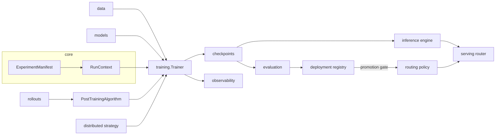

# Architecture

## What

Forgeline is a single Python package (`forgeline`) that covers the language-model lifecycle: data preparation, pretraining, supervised and parameter-efficient fine-tuning, preference optimisation, reinforcement learning (with learned, verifiable and process rewards), distributed execution, checkpointing, evaluation, quantization and export, KV-cached inference, OpenAI-compatible serving, and a model-candidate lifecycle with promotion gates, staged rollout and rollback.

## Why

Post-training systems fail at the seams: a DPO script that saves checkpoints differently from the SFT script, an RL loop with its own optimizer handling, an evaluator whose metric names do not match the promotion policy. Forgeline puts every stage behind the same small set of contracts so the output of one stage is the input of the next without glue code.

## How

### Package layout

| Package | Responsibility |
|---|---|
| `core` | `ModelSpec` + presets, `TrainerConfig`, `ExperimentManifest` (YAML/TOML/JSON), protocols, registry, runtime (device, dtype, seeding, RNG state), `RunContext`, typed errors |
| `observability` | structured logging, metrics sinks (local JSONL, no-op, W&B, TensorBoard), lifecycle events, timing spans |
| `data` | tokenizers (char, tiktoken, HuggingFace), record schemas with validation, memmap corpora, streaming/sharding, SFT/preference/verifiable datasets, collators, preprocessing |
| `models` | decoder-only transformer, attention variants (GQA/MHA, latent, native sparse), MoE, multi-token prediction, sampling and speculative decoding, LoRA/QLoRA, NF4, GGUF export, policies (native + HuggingFace), reward model, loading |
| `training` | shared `Trainer` lifecycle and numerical utilities; pretraining, SFT, distillation, reward modelling, DPO, PPO, GRPO (single-turn, tool agent, REINFORCE), DAPO, RLVR, AI-feedback (self-judge, pairwise, constitutional), STaR, hill climbing; `factory` builds any stage from a manifest |
| `rollouts` | rollout engine, multi-turn agent engine, tools (Python executor, tag parser), verifiers, reward providers |
| `distributed` | process-group runtime, 3-D mesh, tensor-parallel layers, pipeline stages + 1F1B schedule, strategies (single, DDP, FSDP, DeepSpeed, tensor, pipeline) |
| `checkpoints` | directory checkpoints with manifest, atomic writes, validation, discovery, resume |
| `evaluation` | structured results, quality/reward/performance suites, standard benchmarks, regression rules, model inspection |
| `inference` | requests, paged block allocator, continuous-batching scheduler, KV-cached engine |
| `serving` | request schemas, backends, transport-agnostic router, HTTP server |
| `deployment` | candidates and states, JSON registry, promotion gates, feature flags, routing policy, rollback |
| `domains.synthesis` | pharmaceutical-synthesis task family: rule reward, constraints, prompt/condition codec, features, preference construction, simulated data, tabular actor-critic PPO |
| `cli` | `forgeline` command |

### Core contracts

| Contract | Defined in | Implemented by |
|---|---|---|
| `PolicyModel` | `core/protocols.py` | `NativePolicy`, `HFPolicy` |
| `RewardProvider` | `core/protocols.py` | rule, verifier, composite, process, critic, reward-model, synthesis rewards |
| `Verifier` | `core/protocols.py` | math, exact match, tagged answer, code execution, format |
| `Trajectory` | `core/protocols.py` | produced by `RolloutEngine` / `AgentRolloutEngine` |
| `PostTrainingAlgorithm` | `training/common/trainer.py` | every step-based training stage |
| `DistributedStrategy` | `core/protocols.py` | `distributed/strategies.py` |
| `EvaluationSuite` → `EvaluationResult` | `core/protocols.py` | `evaluation/*` |
| `MetricsSink` | `observability/metrics.py` | local / no-op / W&B / TensorBoard |

### Training lifecycle

`Trainer.train_step()` for every algorithm:

1. set the learning rate from the schedule;
2. `algorithm.collect(step)` — sample batch or run rollouts;
3. for each gradient-accumulation micro-step: `algorithm.loss(batch, i, n)` under autocast, reject non-finite loss, backward through the gradient scaler;
4. unscale and clip gradients; optimizer step;
5. log metrics; periodic evaluation, checkpointing and best-checkpoint tracking in `fit()`.

Algorithms own only their mathematics. Optimizer construction (matrix-only weight decay), precision, clipping, checkpoint format, RNG capture and events are identical across stages.

## Configuration

Every run is described by an `ExperimentManifest`; see [configuration](configuration.md) and the examples in `configs/`. `forgeline validate <manifest>` checks a manifest (including distributed topology) without running it.

## Failure modes

All errors derive from `ForgelineError` and carry a `hint`. Unknown configuration keys are rejected rather than ignored.

## Local validation

`python -m pytest tests` (CPU) and `scripts/local_validation.sh`.

## Hardware requirements

CPU for everything at tiny scale. CUDA for bf16/fp16 training at scale, FSDP, NCCL tensor/pipeline parallelism and DeepSpeed.

## Limitations

See the Limitations section of each subsystem document.
