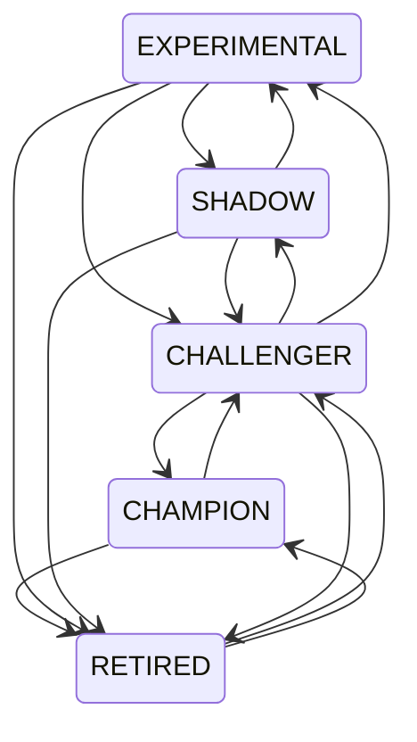

# Deployment: registry, promotion gates, staged rollout and rollback

## What

A local model-candidate registry with lifecycle states, fail-closed promotion gates, feature flags with percentage rollout, deterministic champion/challenger/shadow routing, offline replay, immediate rollback and a candidate kill switch.

## Why

Training produces candidates; deciding which one serves traffic must be explicit, reproducible and reversible — without a database or cloud service.

## How

### Candidates (`deployment/candidates.py`)

Metadata: name, version, algorithm, checkpoint, tokenizer, dataset, precision, distributed strategy, model spec, metrics, state, timestamps, promotion status and report, rollback target, tags, history.

States and allowed transitions:



`RETIRED → CHAMPION` is used by rollback; every transition is appended to the candidate history.

### Registry (`deployment/registry.py`)

JSON file with atomic writes. `register` (unique name:version), `get`, `find`, `list(state, name)`, `record_metrics`, `champion(name)` (at most one), `transition`. Promoting a new champion retires the previous one and records it as the new champion's `rollback_target`.

### Promotion gates (`deployment/promotion.py`)

`GateRule(metric, min, max, min_delta, max_increase, relative)`:

* `min` / `max` — absolute bounds (inclusive);
* `min_delta` — `candidate ≥ baseline + delta`;
* `max_increase` — `candidate ≤ baseline + increase`;
* `relative` — deltas as a fraction of the baseline.

`PromotionGate(rules, require_baseline=False, when_no_baseline="fail"|"skip_relative")`. Every rule must pass. Missing or non-finite candidate metrics fail; relative rules without a baseline fail unless `skip_relative` is set (only for the first champion). `assert_promotable` raises `PromotionError` listing failing dimensions; `report.to_dict()` is stored on the candidate.

Typical gate dimensions: reward, accuracy, pass rate, safety regression, latency, throughput, memory, malformed-output rate, KL drift.

### Routing (`deployment/rollout.py`)

`RoutingPolicy(champion, challenger, challenger_percent, shadow, shadow_percent, salt, pinned, disabled)`:

* bucket = `sha256(salt:request_id)` mod 10,000 — the same request id always routes the same way;
* bucket < `challenger_percent × 100` → challenger, else champion;
* independent shadow bucket decides whether the shadow receives a copy;
* `pinned` request ids / explicitly requested models bypass hashing;
* disabled backends are never selected.

`simulate_traffic(policy, request_ids)` → routed fractions. `offline_replay(backends, prompts, scorer)` → mean score per backend for offline A/B comparison. Policies save/load as JSON.

### Feature flags (`deployment/feature_flags.py`)

`FeatureFlag(name, enabled, percentage, allow, deny, salt)`; `FeatureFlags(path)` persists to JSON; `is_on(name, key)` is deterministic per key.

### Rollback (`deployment/rollback.py`)

`rollback(registry, name, reason, routing=None)` retires the current champion, restores its `rollback_target` as champion, clears the rollback target, points the routing policy's champion at the restored model, removes the rolled-back model from the challenger slot and disables it. It refuses when there is no champion or no rollback target. `disable_candidate(registry, id, routing)` stops routing to a candidate immediately without changing states.

## Configuration

`configs/deployment/promotion_gate.yaml`, `configs/deployment/routing_champion_challenger.json`.

```bash
forgeline registry --registry registry.json register --name assistant --version v2 --algorithm dpo \
    --checkpoint runs/dpo/checkpoints/final --metrics-file eval.json
forgeline registry --registry registry.json promote --id <id> --to champion --gate configs/deployment/promotion_gate.yaml
forgeline registry --registry registry.json rollback --name assistant --reason "latency regression"
forgeline registry --registry registry.json disable --id <id>
forgeline serve --checkpoint DIR --routing configs/deployment/routing_champion_challenger.json
```

`promote --to champion` stages an experimental candidate through `challenger` automatically; with `--gate` it exits with status 2 and prints the report when rejected.

## Failure modes

| Condition | Behaviour |
|---|---|
| duplicate name:version, unknown id, illegal transition, >1 champion, corrupt registry file | `RegistryError` |
| gate failure | rejected report / `PromotionError` |
| gate without rules, rule without constraint, min > max | `ConfigError` |
| percentages outside [0, 100], percentage without target backend | `ConfigError` |
| rollback without champion or target | `RegistryError` |

## Local validation

`tests/unit/test_deployment.py`: promotion success, rejection, boundaries (inclusive), missing metric, NaN metric, relative rule without baseline, invalid configs, first-champion mode; registry persistence and transitions; rollback (routing updated, previous champion restored) and disable; routing determinism and 10%/20% split accuracy over 20,000 ids, disabled and pinned backends; feature-flag percentages, allow/deny, persistence; offline replay. `tests/integration/test_cli_pipeline.py` exercises the CLI gate path. `examples/01_end_to_end_lifecycle.py` runs the full flow.

## Hardware requirements

None beyond the backends being served.

## Limitations

* The registry is a single JSON file intended for one writer process.
* Shadow requests are decided but not dispatched by the HTTP router; compare shadow candidates with `offline_replay`.
